# Space Onboarding & Lifecycle Design

**Status:** Design approved — Phase 2 dashboard + Mess Guided Setup completed; Progressive Guided Workflow Phases 3–5 **COMPLETE**; Lifecycle Phase 4 Coachmarks **COMPLETE**; Lifecycle Phase 5 Health Score **COMPLETE**  
**Audience:** Product, design, engineering  
**Scope:** Owner/operator experience across all space types  
**Related:** `space-ui-integration.md`, `my-spaces-ui-integration.md`, `notification-event-catalog.md`, `accommodation-lifecycle-ui-integration.md`, `Progressive-Guided-Workflow-UX-Audit.md`, `Post-Lifecycle-Stabilization-Roadmap.md`

---

## Implementation Status

### Phase 1 — Space Lifecycle Engine Foundation

**Status:** ✅ Completed

**Summary**

- Space Lifecycle Engine under `src/spaceLifecycle/`
- Profiles, milestones, predicates, recommendation, lifecycle evaluation
- `useSpaceLifecycle` hook + unit tests
- No UI changes in Phase 1

### Phase 2 — Lifecycle-aware Dashboard & Business Setup Experience

**Status:** ✅ Completed

**Summary**

- Owner Dashboard consumes `useSpaceLifecycleSignals` → `useSpaceLifecycle`
- Technical checklist replaced with **Next Recommended Step** + **business milestones**
- Lifecycle-driven widget visibility (NEW / SETUP / READY / ACTIVE / NEEDS_ATTENTION)
- CTA navigation maps to existing screens only (Quick Setup, Members, Menu Library, etc.)
- Pending Actions remain SoT (elevated via existing quick-action placement)
- No backend changes
- Tenant / customer / meal-participant dashboards unchanged

### Mess Guided Setup

**Status:** ✅ Completed

**Summary**

- Mess is a **profile** inside the same Space Lifecycle Engine (not a separate onboarding framework)
- Required: Mess created → Menu library → Customers → Today's menu → Menu shared → Ready to operate (derived)
- Recommended: Delivery locations
- Dependency-aware Next Step (never recommend Share before customers)
- Mess-only dashboard visibility: meal ops + setup quick actions during NEW / SETUP
- Mess business copy for hero, milestones, recommendations, Menu Planning / Share guards
- PG / Hostel / Rental / Co-living profiles and dashboard behavior unchanged
- No backend / schema changes — signals reuse existing APIs + meal day query cache

### Phase 3 — Progressive Guided Workflow (High Priority)

**Status:** ✅ Completed

**Summary**

- Shared `ProgressiveWorkflowFooter` + `useProgressiveSectionReview` (generalized from Daily Menu Edit)
- High Priority screens from UX audit: Occupancy Contract, Mess Add/Edit Member, Menu Share Preview, Quick Setup sticky Generate, Edit Space section nav
- Aligns with Dashboard Design A; reuses horizontal Business Progress Stepper where wizards already have steps
- No backend changes
- Details: `Progressive-Guided-Workflow-UX-Audit.md` (implementation status + manual test guide)

### Phase 4 — Progressive Guided Workflow (Medium Priority)

**Status:** ✅ Completed

**Summary**

- Shared `StickyFormActions` for sticky Create/Save/Submit/decision CTAs
- Create Space sticky Create + light amenities progressive when applicable
- Raise Complaint sticky Submit + optional Continue to photos
- Payment Detail / Complaint Detail sticky operator (and pay) actions
- Hierarchy Building/Floor/Unit/Room/Bed forms: sticky Save; Unit/Room/Bed create pricing hint
- No backend changes; no new lifecycle states
- Details: `Progressive-Guided-Workflow-UX-Audit.md`

### Phase 5 — Progressive UX Polish & Consistency

**Status:** ✅ Completed — **Progressive Guided Workflow initiative closed**

**Summary**

- Customer Subscription Request progressive footer (plan → payment details → submit)
- Complete Profile sticky Next / Back / Submit
- Unified sticky chrome + safe-area insets (`stickyBarChrome`, `useStickyBarPaddingBottom`)
- All ad-hoc sticky bars migrated to `StickyFormActions`
- Pricing hint + subscription empty-state copy polish
- No Coachmarks / Health Score / backend changes
- Details: `Progressive-Guided-Workflow-UX-Audit.md`

### Lifecycle Phase 4 — Coachmarks

**Status:** ✅ Completed (2026-07-25)

**Summary**

- Reusable coachmark framework: `CoachmarkProvider`, `CoachmarkOverlay`, `CoachmarkCard`, `CoachmarkAnchor`, `CoachmarkSequence`, `useCoachmarks`
- Local persistence `@countin/coachmarks/{spaceId}/{tourId}` (`completed` | `skipped`) via `coachmarkStorage`
- Lifecycle gate: `NEW` | `SETUP_IN_PROGRESS` only; never auto-show for READY / ACTIVE / NEEDS_ATTENTION
- Accommodation tour `setup.accommodation.v1` on Accommodation (empty + owner) ≤3 steps
- Mess tour `setup.mess.v1` on Dashboard setup card ≤3 steps
- Kill switch: `ENABLE_SETUP_COACHMARKS`
- No navigation from coachmarks; Skip / Next / Got it / outside / Back all dismiss permanently
- Future Replay Tips: `clearCoachmarkRecord` + `forceReplay`
- No Health Score / backend / Progressive WF changes

### Lifecycle Phase 5 — Space Health Score

**Status:** ✅ Completed (2026-07-25) — secondary insight only

**Summary**

- `src/spaceLifecycle/health/` — weights, signals, `calculateSpaceHealth`, `useSpaceHealth`
- Dashboard widget + breakdown (Setup 50% / Operations 30% / Attention 20%)
- Reuses lifecycle evaluation + Pending Actions; suggestions from Recommendation Engine
- Empty state for brand-new spaces (no vanity 0%); setup-incomplete score cap
- No enterprise portfolio, no backend, no Progressive WF / Coachmark changes

### Remaining (Lifecycle roadmap)

| Phase | Status |
|-------|--------|
| Phase 3 — Contextual empty states | 🟡 Partial (Mess meal/financial empty hints done; module empties remain) |
| Progressive Guided Workflow (Phases 3–5) | ✅ **Complete** |
| Lifecycle Phase 4 — Coachmarks | ✅ **Complete** |
| Lifecycle Phase 5 — Health Score | ✅ **Complete** (secondary widget; no enterprise portfolio) |
| Mess Guided Setup | ✅ Completed |

**Lifecycle roadmap (Phases 1–5 engine + dashboard + coachmarks + health): implemented.** Enterprise portfolio / My Spaces rollup remains out of scope.

**Next execution plan:** `Post-Lifecycle-Stabilization-Roadmap.md` — Stabilization → Localization → Cleanup → Empty states → Replay Tips → Architecture Freeze (Enterprise Portfolio postponed).

---

## Executive Summary

CountIn already has the building blocks of onboarding and attention:

- Space-type gates (`isAccommodationApplicable`, meal/serving policies, member roles)
- Create-space → enter space flow
- A temporary technical setup checklist on the owner dashboard
- Pending Actions + Global Attention as the operational “needs attention” source of truth
- Module empty states and Quick Setup for property bootstrap

What is missing is a **business-oriented lifecycle model**: owners still see technical tasks (“add floors / beds”) and a one-size checklist that does not match Mess, Rental, or Co-living realities.

This document defines a **Space Lifecycle Engine** that:

1. Speaks in **business milestones** (Property Ready, Residents Ready, Meals Ready)—not technical CRUD steps.
2. Derives the **next recommended business action** from live state + existing feature gates.
3. Evolves the **dashboard** by lifecycle (setup vs operations vs attention).
4. Scales to new space types via **profiles**, without rewriting onboarding.
5. Reuses existing modules, permissions, APIs, and Pending Actions—**no parallel attention system**.

**Health Score vs Setup Progress:** Prefer a **Setup / Readiness Progress** driven by weighted milestones during onboarding, then switch to **operational attention signals** (Pending Actions) once ready. A single blended “Space Health %” is optional and secondary—see §12.

---

## Current Problems

| Problem | Evidence in product today |
|---------|---------------------------|
| “Now what?” after create | Empty dashboard zeros; property empty state lives on Accommodation, not always the landing path |
| Technical checklist | `spaceSetupProgress` exposes createBuilding / addFloors / addRooms / addBeds |
| Wrong steps per type | Rental asked for beds; Mess shown structure steps historically; meals treated as required for all |
| Feature-oriented UX | Owners navigate tabs instead of following a business outcome |
| Dual attention concepts | Setup incomplete vs Pending Actions / Global Attention not clearly sequenced |
| Inconsistent empty copy | Some modules use rich CTAs; others feel like “no data” |
| Hard to extend | New space type would require scattered `if (type === …)` changes |

---

## Goals

1. Always answer: **What should I do next?** and **Why?**
2. Make onboarding **space-type aware** and **permission aware**.
3. Separate **setup** from **daily operations** from **needs attention**.
4. Keep the dashboard contextual to lifecycle.
5. Reuse existing architecture; invent no duplicate workflows or APIs unless unavoidable.
6. Ship in phases with minimal rework.

### Non-goals

- Rewriting accommodation, meals, payments, or notification backends.
- Replacing Pending Actions / Global Attention.
- Joyride-style tours on every screen.
- Enterprise multi-property portfolio onboarding (future extension only).

---

## Design Principles

1. **Business over features** — Milestones describe outcomes (“Property Ready”), not entities (“Create Floor”).
2. **Discover, don’t assume** — Milestone applicability comes from existing gates (`accommodationProfile`, meal policies, roles).
3. **One recommendation** — Surface a single highest-priority next action; progress is secondary.
4. **Lifecycle over screens** — Dashboard composition follows lifecycle state, not a fixed widget list.
5. **Attention has one SoT** — Operational urgency = Pending Actions / Global Attention (`notification-event-catalog.md`).
6. **Internal vs external model** — Technical steps exist only inside the engine; UI never lists them as primary checklist items.
7. **Profiles, not forks** — Space types differ by **setup profile** data, not separate onboarding codepaths.
8. **Permissions first** — Never recommend a CTA the user cannot perform.

---

## Supported Space Types

Discovered canonical union (`src/api/types.ts`, `SPACE_TYPE_VALUES`):

| Code | Label | Product orientation |
|------|-------|---------------------|
| `PG` | PG (Paying Guest) | Bed lodging + optional meals |
| `HOSTEL` | Hostel | Same inventory model as PG |
| `CO_LIVING` | Co-living | Unit → room → bed |
| `RENTAL` | Rental (Flats / Rooms) | Unit-only inventory |
| `MESS` | Mess / Canteen | Meals-first; no accommodation |

No additional space types exist in the codebase today.

---

## Feature Matrix (capability gates)

Reuse these utilities; do not duplicate:

| Capability | Gate / source | PG | HOSTEL | CO_LIVING | RENTAL | MESS |
|------------|---------------|----|--------|-----------|--------|------|
| Accommodation | `isAccommodationApplicable` | ✓ | ✓ | ✓ | ✓ | ✗ |
| Layout default | `defaultLayoutModeForSpaceType` | Corridor PG | Corridor PG | Co-living | Rental | — |
| Allocatable target | `occupancyRules` | BED | BED | BED (/ROOM*) | UNIT | — |
| Quick Setup | Wizard steps by type | Full | Full | Full | No rooms step | Blocked |
| Amenities / gender policy | `supportsSpaceAmenities` / `supportsSpacePropertyCategory` | ✓ | ✓ | ✓ | ✗ | ✗ |
| Default member role | `defaultRoleForSpaceType` | TENANT | TENANT | TENANT | TENANT | CUSTOMER |
| Meals tab | Role `canViewMeals` | ✓ | ✓ | ✓ | ✓† | ✓ |
| Separate meal billing | `usesSeparateMealBilling` | ✗ | ✗ | ✗ | ✗ | ✓ |
| Serving locations | `servingLocationMode` | property | property | property | hidden | delivery |
| Menu share eligible | `isMealShareCompatibleSpace` | ✓ | ✓ | ✓ | ✗ | ✓ |
| Payments / Complaints | Role + category helpers | ✓ | ✓ | ✓ | ✓ | ✓ (mess categories) |

\*ROOM allocation for Co-living is allowed but marked unfinished—onboarding should not depend on it.  
†Rental meals exist in nav but share/serving are suppressed—treat meals as **out of setup** until product clarifies (Open Questions).

---

## Space Lifecycle

### States

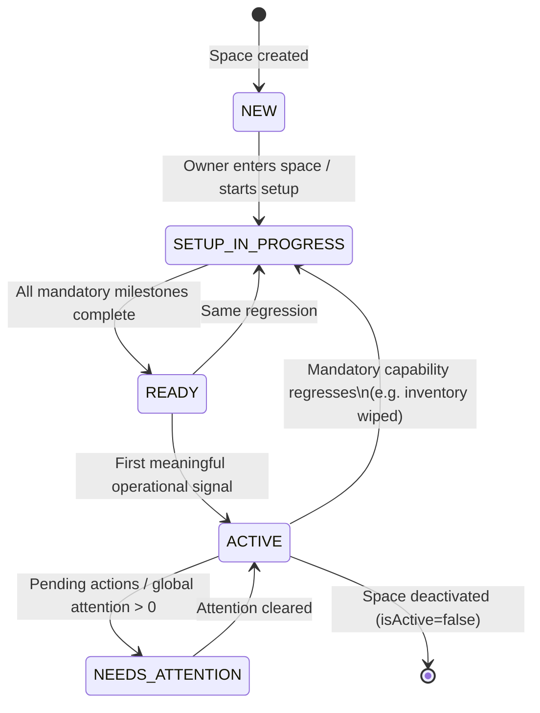

| State | Meaning |
|-------|---------|
| **NEW** | Space exists; no meaningful setup yet (just created or never started). |
| **SETUP_IN_PROGRESS** | At least one mandatory milestone incomplete. |
| **READY** | Mandatory milestones complete; daily ops not yet “proven.” |
| **ACTIVE** | Space is operable and has shown operational use (or soft-graduate after READY + time/action). |
| **NEEDS_ATTENTION** | Overlay on READY/ACTIVE when Pending Actions / Global Attention require operator work. |

**Note:** `NEEDS_ATTENTION` is a **mode** layered on READY/ACTIVE, not a replacement for setup. Setup never competes with payment review urgency—attention wins on surfaces that already show badges.

### Transition rules (derived, client-side)

| From → To | Condition (reuse existing signals) |
|-----------|-------------------------------------|
| → NEW | Create space success; or open space with zero progress on mandatory milestones |
| → SETUP_IN_PROGRESS | Any mandatory milestone incomplete |
| → READY | All mandatory milestones complete; pending actions may still be 0 |
| → ACTIVE | READY **and** (`hasOperationalSignal` OR owner completed optional “Go to dashboard” after N days)—see Decision Table |
| → NEEDS_ATTENTION | `pendingActions.totalCount > 0` **or** My Spaces `needsAttention` for this space |
| ← SETUP | Inventory/members required signals drop below completion (rare) |
| Exit | `deactivateSpace` / removed from my spaces |

`hasOperationalSignal` (suggested, no new API required if we compose existing data):

- Any occupancy allocation, **or**
- Any payment in summary period, **or**
- Any meal poll/order activity, **or**
- Any complaint

If those are expensive on first paint, **ACTIVE can soft-equal READY** in v1 (graduate on first visit after READY). Documented as a phased choice.

### Per-state dashboard composition

| Surface | NEW / SETUP_IN_PROGRESS | READY | ACTIVE | NEEDS_ATTENTION |
|---------|-------------------------|-------|--------|-----------------|
| **Hero** | Welcome + space name; setup-oriented subtitle | “You’re ready” / ops subtitle | Standard `DashboardOwnerHero` | Hero + attention emphasis OR pending banner |
| **Primary card** | Next Recommended Action | Optional soft tips (optional milestones) | Hidden onboarding | Pending Actions card (existing) |
| **Setup Progress** | Visible (milestones) | Hidden (or collapsed “Improve setup”) | Hidden | Hidden |
| **Financial snapshot** | Optional / muted | Visible | Visible | Visible |
| **Accommodation ops** | Hide or dim until Property Ready | Visible if applicable | Visible | Visible |
| **Meal ops** | Hide until Meals milestone relevant / Mess mandatory | Visible if meals managed | Visible | Visible |
| **Quick Actions** | Only setup-relevant CTAs | Full operator QA | Full operator QA | Pending-first + QA |
| **Empty states** | Setup-oriented | Soft “not used yet” | Operational empty | Attention deep-links |
| **Notifications / badges** | Low priority | Normal | Normal | Bell + tab badges (existing) |
| **Recommended CTA** | Engine top action | Optional engine tip or none | None (ops) | Top pending action group |

### Landing screen after create / first open

| Space type | Landing | Why |
|------------|---------|-----|
| PG, HOSTEL, CO_LIVING, RENTAL | Accommodation tab (once if property incomplete) | Inventory unlocks everything else |
| MESS | Dashboard (meals-oriented next step) | No accommodation; meals-first |

Aligns with current Create Space behavior (`isAccommodationApplicable`) and auto-open Accommodation storage flag.

---

## Business Milestones

### Concept

**Milestone** = owner-facing business outcome.  
**Technical steps** = internal predicates + navigation targets (never primary UI).

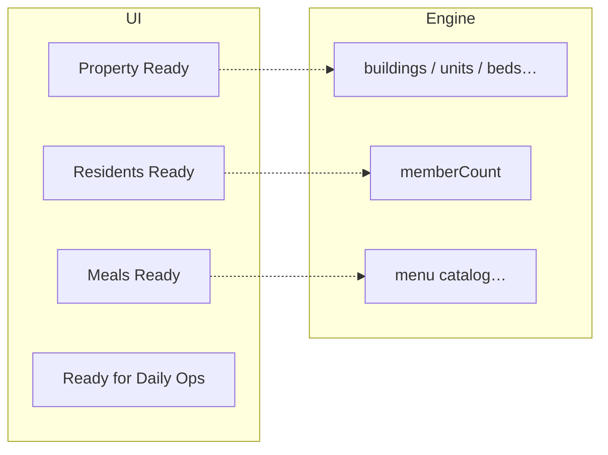

### Canonical milestone catalog

| Milestone ID | Owner-facing name | Kind | Applies when |
|--------------|-------------------|------|--------------|
| `SPACE_CREATED` | Space created | Required (always done after create) | Always |
| `PROPERTY_READY` | Property ready | Required | `isAccommodationApplicable` |
| `RESIDENTS_READY` | Residents ready / Customers ready | Required | Always (copy by type) |
| `MEALS_READY` | Meals ready | Required for Mess; **Optional** for PG/Hostel/Co-living; **Omitted** for Rental (until clarified) | Gate: meals product rules |
| `DELIVERY_READY` | Delivery ready | Recommended (Mess) | `servingLocationMode === 'delivery'` |
| `OPS_READY` | Ready for daily operations | Derived | All required milestones complete |

### Internal technical mapping (engine only)

#### PROPERTY_READY

| Space type | Done when | Primary CTA target |
|------------|-----------|-------------------|
| PG / HOSTEL | `buildingCount > 0` **and** `beds > 0` (floors/rooms implied by bed graph) | Quick Setup / Accommodation |
| CO_LIVING | `buildingCount > 0` **and** `beds > 0` (via units→rooms) | Quick Setup / Accommodation |
| RENTAL | `buildingCount > 0` **and** `units > 0` | Quick Setup (3-step) / Accommodation |
| MESS | N/A (milestone omitted) | — |

Technical substeps (Progress detail drawer only, optional): Create building → structure → rooms/beds or units—as already implemented by Quick Setup.

#### RESIDENTS_READY

| Space type | Done when | CTA |
|------------|-----------|-----|
| Lodging types | `memberCount > 0` (tenants/customers as returned by `getMembers`) | Members / Add Member / Invite |
| MESS | `memberCount > 0` (customers) | Members / Add Member |

Copy: “Residents” vs “Customers” from space type.

#### MEALS_READY

| Space type | Kind | Done when | CTA |
|------------|------|-----------|-----|
| MESS | Required | Active menu library items **or** combos (`fetchSpaceMenuCatalog`) | Menu Library |
| PG / HOSTEL / CO_LIVING | Optional | Same library signal **or** first planned/shared menu (phase 2) | Menu Library / Menu Planning |
| RENTAL | Omitted | — | — |

#### DELIVERY_READY (Mess)

Done when ≥1 delivery location exists (existing Meal Delivery Locations module). Recommended, not mandatory for READY.

#### OPS_READY

Derived label when all **required** milestones for the profile are complete. Not a separate data fetch.

---

## Dynamic Recommendation Engine

### Responsibility

Given `(spaceType, permissions, liveState)` → return one **RecommendedAction**:

```ts
RecommendedAction {
  milestoneId: MilestoneId
  priority: number
  titleKey: string          // business language
  reasonKey: string         // why it matters
  ctaLabelKey: string
  navigation: NavigationTarget  // existing screens only
  kind: 'required' | 'recommended' | 'optional'
}
```

### Evaluation order (priority)

1. If user lacks permission for an action → skip (do not recommend).
2. Evaluate **required** milestones in profile order; return first incomplete.
3. Else evaluate **recommended** milestones in profile order.
4. Else evaluate **optional** milestones (soft tips; may be suppressed after dismiss).
5. Else → `null` (setup complete / no tip).

### Profile-driven, not hardcoded trees

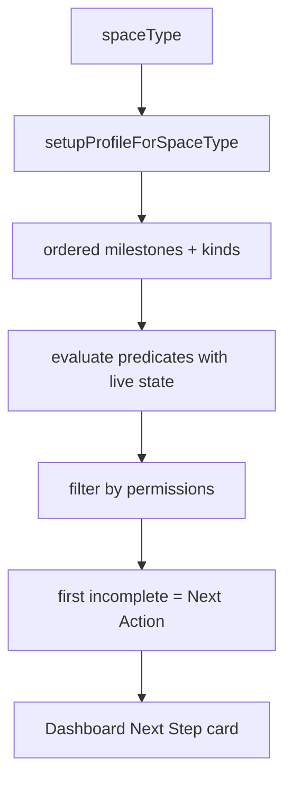

`setupProfileForSpaceType` **composes** existing helpers:

- `isAccommodationApplicable`
- `getAccommodationUiProfile` / occupancy targets
- `servingLocationMode` / `usesSeparateMealBilling`
- `isMealShareCompatibleSpace` (for whether meals belong in profile)
- `resolveSpacePermissions`

Adding a future space type = new profile entry + gate updates—not a new onboarding feature.

### Example next-action outcomes

| Situation | Recommendation (business) | Navigate to |
|-----------|---------------------------|-------------|
| PG, no buildings | Continue setup — get your property ready | Quick Setup |
| PG, buildings but no beds | Continue setup — finish property layout | Accommodation / Builder |
| PG, property ready, no members | Add residents | Members / Add Member |
| PG, required done, no menu | Configure meals (optional) | Menu Library |
| Mess, no catalog | Configure your menu library | Menu Library |
| Mess, catalog, no customers | Add customers | Members |
| Mess, required done, no delivery | Add delivery locations (recommended) | Delivery Locations |
| Any, setup complete, pending > 0 | Do not show setup tip; show Pending Actions | Existing pending flow |

---

## Dashboard Evolution

### NEW / SETUP_IN_PROGRESS

```
┌ Hero: Good evening, {Space} ─────────────┐
├ Next: Get your property ready ───────────┤
│  Beds, residents, and payments depend    │
│  on this.                                │
│  [ Continue Setup ]                      │
├ Setup Progress ── 40% ████░░░░ ──────────┤
│  ✓ Space created                         │
│  ● Property ready      Required          │
│  ○ Residents ready     Required          │
│  ○ Meals ready         Optional          │
├ Financial (optional / muted) ────────────┤
└ Quick actions: only setup-related ───────┘
```

Hide or de-emphasize occupancy/meal operation cards until their milestone allows meaningful numbers (avoid “0 / 0 / 0” as the hero story).

### READY

```
┌ Hero: You're ready to operate ───────────┐
├ Optional tip (dismissible) ──────────────┤
├ This month (financial) ──────────────────┤
├ Property / Meal operations ──────────────┤
└ Quick Actions (full) ────────────────────┘
```

Onboarding card hidden. Optional milestone tips at most once.

### ACTIVE

Standard owner dashboard (current Design A): financial, ops, meal ops, quick actions. No setup chrome.

**Quick Setup Preview (Step 4)** uses the same Design A language as the Owner Dashboard (`DashboardOwnerHero`, `DashboardStatCard`, `DashboardSectionHeader`, Lucide icon circles, spacing/typography/color tokens). Do not introduce a separate preview visual system.

### NEEDS_ATTENTION

Same as ACTIVE/READY **plus**:

- Pending Actions quick card (existing) elevated
- Bell / tab badges unchanged (existing SoT)
- Setup card remains hidden

---

## Empty States

Principle: every empty module explains **why** and **what to do next**, aligned with the same recommendation engine where possible.

| Module | Setup-oriented empty | Ops-oriented empty |
|--------|----------------------|--------------------|
| **Accommodation** | Welcome — create property layout → Start Setup / Add Building | No buildings match filters / search |
| **Members** | No residents/customers yet → Add / Invite | No matches for filters |
| **Meals (library)** | No menu library — configure first → Open Library | — |
| **Meals (planning)** | Plan today’s menu → Plan Menu | Date has no plan |
| **Payments** | No payments yet — add residents / collect | Filter empty (existing) |
| **Complaints** | No complaints — good standing | Filter empty |
| **Delivery (Mess)** | Add delivery locations to take orders | — |

Reuse `EmptyState` + nearby `Button` pattern from Accommodation home; extend copy via i18n keys per space family (lodging vs mess).

---

## Setup Progress (UI)

### What owners see

- Milestone list (business names only)
- Overall **required** completion % (optional milestones excluded from denominator **or** shown separately)
- Visual bar
- Badges: Required / Recommended / Optional / Done

### What owners do **not** see

- Create floor / room / bed as peer checklist rows  
  (Optional “What’s left inside Property ready?” expansion can list substeps for power users—default collapsed)

### Distinction rules

| Kind | Affects READY? | Shown in %? | After READY |
|------|----------------|-------------|-------------|
| Required | Yes | Yes | Hidden with card |
| Recommended | No | Separate “Improve” section optional | Soft tip |
| Optional | No | Excluded from required % | Soft tip / dismiss |
| Completed | — | Counts toward % | — |

---

## Space Health Score (or alternative)

### Recommendation: **do not lead with a blended Health Score**

**Why not (as primary UX):**

1. **Setup readiness ≠ operational health.** A space can be 100% set up and still have 12 payments needing review.
2. CountIn already has a strong operational signal: **Pending Actions / Global Attention**.
3. Blending setup + attention into one % creates misleading “82% Healthy” while critical reviews wait.
4. Weighting optional meals against mandatory property inventory is product-political and hard to explain.

### Preferred model (two layers)

| Layer | Metric | When shown |
|-------|--------|------------|
| **Setup Readiness** | Required milestones complete / total required | NEW + SETUP_IN_PROGRESS |
| **Attention** | Pending action count + groups | READY / ACTIVE / always in My Spaces |

### Optional later: Space Health Score (secondary)

If stakeholders still want a score for enterprise dashboards:

```
Health = 0.6 * SetupReadiness
       + 0.4 * AttentionHealth
```

Where `AttentionHealth = 1 - saturate(pendingCount / threshold)`.

- Required milestones missing → cap Health at &lt; 70% regardless of attention.
- Optional milestones never reduce Health below READY threshold.
- Label bands: Needs setup / Ready / Healthy / Needs attention—not a vanity percentage alone.

**v1 originally shipped without Health Score.** Use Setup Readiness % + Pending Actions as primary.

### Implementation (Lifecycle Phase 5) ✅ — secondary Space Health

Shipped as an **informative** dashboard widget (not primary navigation).

| Category | Weight (configurable) |
|----------|------------------------|
| Setup Readiness | 50% |
| Operational Health | 30% |
| Attention Health | 20% |

Constants: `src/spaceLifecycle/health/healthWeights.ts`  
Calculator: `calculateSpaceHealth` · Hook: `useSpaceHealth`  
Widget: `DashboardSpaceHealthCard` · Breakdown: `DashboardSpaceHealthScreen`

```
Health = 0.5 * Setup + 0.3 * Operations + 0.2 * Attention
```

- Incomplete required setup → overall score capped at `SETUP_INCOMPLETE_SCORE_CAP` (69).
- Brand-new NEW spaces → **unavailable** empty copy (never vanity `0%`).
- Suggestions reuse lifecycle `recommendation` + Pending Actions — no parallel advice engine.
- Bands: Excellent / Healthy / Needs Improvement / At Risk / Critical (always with label).

Primary guidance remains: **Next Recommended Step**, **Business Milestones**, **Pending Actions**.

---

## Coachmark Strategy

Lightweight, local, minimal—not React Joyride everywhere.

| Rule | Detail |
|------|--------|
| **When** | Once after first transition into a space that is NEW/SETUP, on the **landing screen only** (Accommodation or Mess Dashboard) |
| **Steps** | 3 max (e.g. Next Step card → primary CTA → tab that matters) |
| **Disappear** | After last step, Skip, or Outside dismiss |
| **Persistence** | AsyncStorage `@countin/coachmarks/{spaceId}/{tourId}` |
| **Never again** | Unless “Replay tips” in space settings (future) |
| **Not used for** | Every empty state, every tab, returning ACTIVE users |

Empty states + Next Step card carry ongoing guidance; coachmarks are orientation only.

### Implementation (Lifecycle Phase 4) ✅

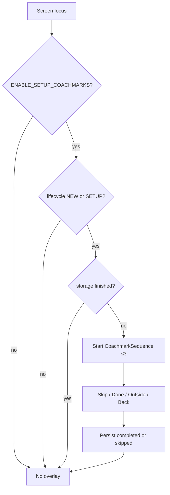

| Piece | Path |
|-------|------|
| Provider + hook | `src/coachmarks/CoachmarkProvider.tsx`, `useCoachmarks` |
| Overlay / card / anchor / sequence | `src/components/coachmarks/*` |
| Visibility + kill switch | `src/coachmarks/visibility.ts` |
| Sequences | `src/coachmarks/sequences.ts` (`setup.accommodation.v1`, `setup.mess.v1`) |
| Storage | `src/utils/coachmarkStorage.ts` |
| Mess landing | `DashboardScreen` + `DashboardSetupProgressCard` anchors |
| Accommodation landing | `AccommodationHomeScreen` (empty owner) anchors |

---

## UI Wireframes (ASCII)

### Next Step + Progress (setup)

```
┌──────────────────────────────────────────┐
│ Getting started                          │
│                                          │
│ Next: Get your property ready            │
│ Inventory unlocks beds, residents, and   │
│ collections.                             │
│                                          │
│ [ Continue Setup ]                       │
│                                          │
│ Setup readiness            33%           │
│ ████░░░░░░░░                             │
│ ✓ Space created                          │
│ ● Property ready           Required      │
│ ○ Residents ready          Required      │
│ ○ Meals ready              Optional      │
└──────────────────────────────────────────┘
```

### Mess variant

```
│ Next: Configure your menu library        │
│ Customers need items before they can     │
│ order and pay.                           │
│ [ Open Menu Library ]                    │
│ ✓ Space created                          │
│ ● Meals ready              Required      │
│ ○ Customers ready          Required      │
│ ○ Delivery ready           Recommended   │
```

### READY / ACTIVE (ops)

```
┌ Hero ────────────────────────────────────┐
├ This month ── Expected / Collected / … ──┤
├ Property operations ── Occupied / Vacant ┤
├ Meal operations ─────────────────────────┤
├ Pending Actions (if any) ────────────────┤
└ Quick Actions ───────────────────────────┘
```

---

## State Diagrams

### Lifecycle (compact)

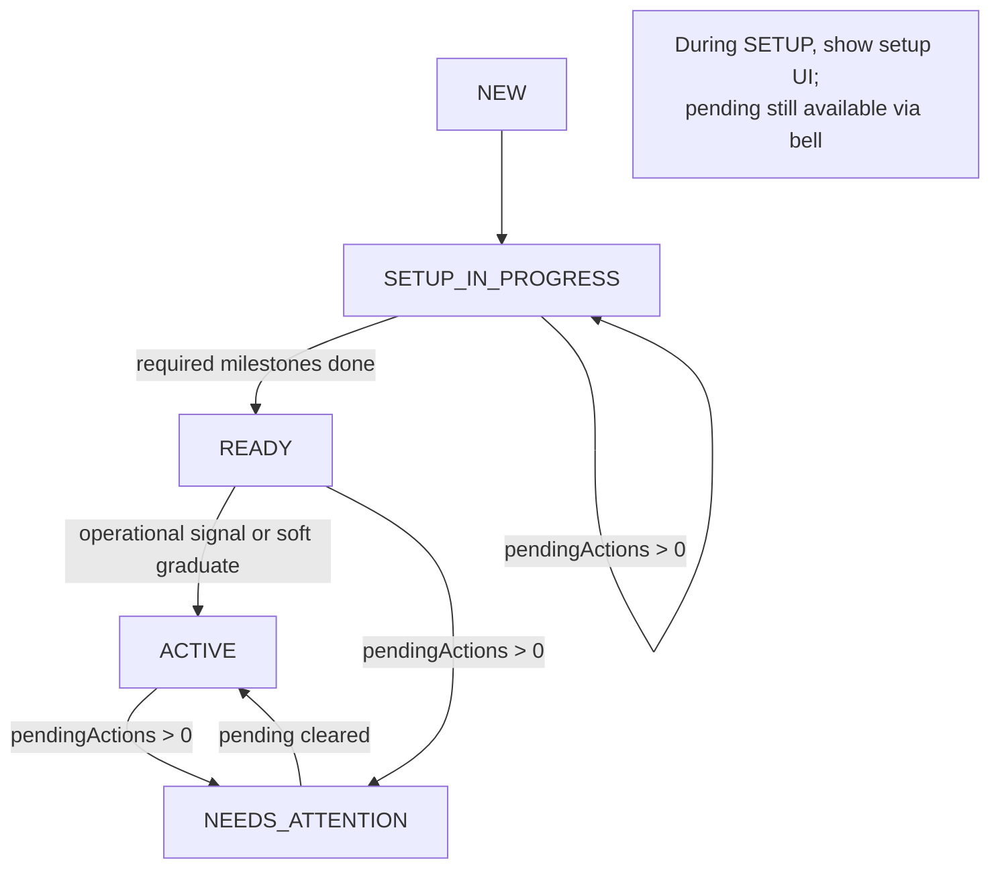

### Recommendation evaluation

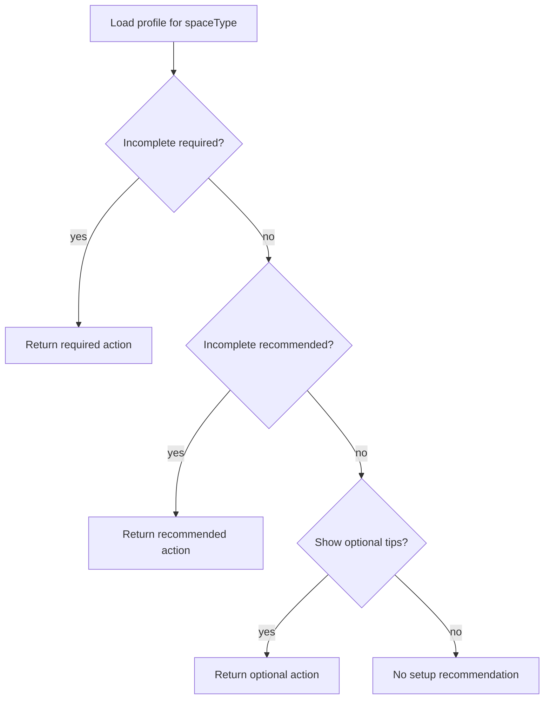

---

## Decision Tables

### Milestone applicability

| Milestone | PG | HOSTEL | CO_LIVING | RENTAL | MESS |
|-----------|----|--------|-----------|--------|------|
| SPACE_CREATED | R | R | R | R | R |
| PROPERTY_READY | R | R | R | R | — |
| RESIDENTS_READY | R | R | R | R | R |
| MEALS_READY | O | O | O | —† | R |
| DELIVERY_READY | — | — | — | — | Rec |
| OPS_READY | derived | derived | derived | derived | derived |

R = required, O = optional, Rec = recommended, — = omit  
†Omit until Rental meals product decision.

### PROPERTY_READY predicate

| Type | Predicate |
|------|-----------|
| PG / HOSTEL / CO_LIVING | buildings ≥ 1 ∧ beds ≥ 1 |
| RENTAL | buildings ≥ 1 ∧ units ≥ 1 |
| MESS | omit |

### Post-create navigation

| Type | Initial tab | Coachmark tour id |
|------|-------------|-------------------|
| Accommodation types | Accommodation | `setup.accommodation.v1` |
| MESS | Dashboard | `setup.mess.v1` |

### Dashboard widget visibility

| Widget | SETUP | READY/ACTIVE | NEEDS_ATTENTION |
|--------|-------|--------------|-----------------|
| Next Step | ✓ | ✗ (optional tip only) | ✗ |
| Setup Progress | ✓ | ✗ | ✗ |
| Financial | soft | ✓ | ✓ |
| Accommodation ops | after PROPERTY_READY | ✓ | ✓ |
| Meal ops | Mess: after MEALS_READY start; others: if meals managed | ✓ | ✓ |
| Pending card | if count>0 | if count>0 | ✓ elevated |
| Full Quick Actions | limited | ✓ | ✓ |

---

## Navigation Flow

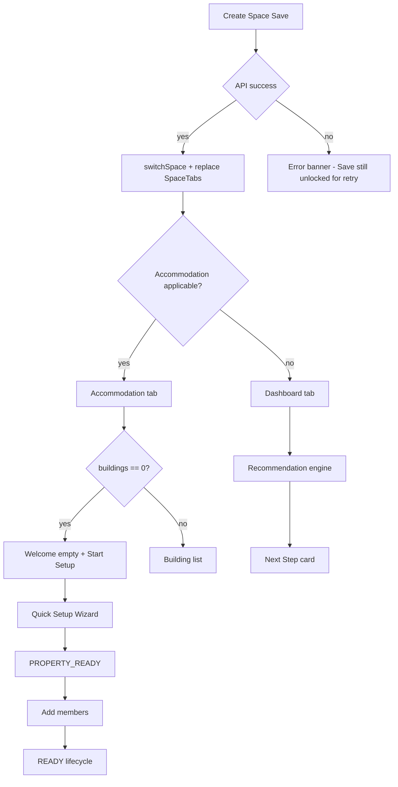

Deep links from Next Step use **existing** routes only:

- `QuickSetupWizard`, `BuildingForm`, `Accommodation` tab  
- `Members`, `AddMember`, `InviteMember`  
- `Meals` / Menu Library / Menu Planning  
- `MealDeliveryLocations`  
- `DashboardPendingActions`

---

## Component Reuse Strategy

| Need | Reuse / evolve |
|------|----------------|
| Next Step + Progress UI | Evolve `DashboardSetupProgressCard` → milestone-oriented API |
| Hero | `DashboardOwnerHero` (subtitle by lifecycle) |
| Empty + CTA | `EmptyState` + `Button` (Accommodation home pattern) |
| Property bootstrap | `QuickSetupWizardScreen`, builder screens |
| Members | Existing member flows |
| Meals | Menu library / planning screens |
| Attention | `PendingActionsQuickCard`, bell, Global Attention (unchanged SoT) |
| Auto-land Accommodation | `spaceSetupStorage` + Dashboard effect |
| Create success | Current Create Space lock + toast + replace navigation |

**Replace:** technical step list in `buildSpaceSetupProgress` with milestone evaluator (same hook surface can remain `useSpaceSetupProgress` → rename later to `useSpaceLifecycle` if desired).

---

## APIs Reused (no new APIs required for v1)

| Signal | API / client helper |
|--------|---------------------|
| Buildings | `accommodationApi.getBuildings` |
| Structure counts | `getBuildingSummary` (floors/units/rooms/beds) |
| Members | `memberApi.getMembers` |
| Meal library | `fetchSpaceMenuCatalog` |
| Pending actions | Existing pending-actions / dashboard-summary |
| Global attention | Existing global dashboard endpoints |
| Space session | `spaceStore` refresh / switchSpace / deactivate |

**Optional later (only if needed):** delivery-location count endpoint if not already listable; daily menu “has plan” peek—defer to phase 2 optional meals tip.

---

## Feature Gates Reused

- `isAccommodationApplicable`, `getAccommodationUiProfile`, `defaultLayoutModeForSpaceType`
- `layoutModesForSpaceType`, Quick Setup step lists
- `occupancyRules` (allocatable target)
- `defaultRoleForSpaceType`, `assignableRolesForSpaceType`
- `usesSeparateMealBilling`, `servingLocationMode`, `isMealShareCompatibleSpace`
- `canEnableMealsForMember` / meal permissions
- `resolveSpacePermissions` / `canManage*` flags
- `shouldShowDashboardMealOperations`
- Complaint `categoriesForSpaceType`

---

## Edge Cases

| Case | Behavior |
|------|----------|
| Create API succeeds, navigation fails | Toast success; keep submit locked; offer “Open space” retry using known `spaceId` |
| Double-tap Save | In-flight lock (already designed) |
| Staff without manage accommodation | Skip property CTAs; show read-only empty / permission denied |
| Mess user opens Accommodation | Tab absent; engine never recommends it |
| Rental with beds in backend unexpectedly | Still complete PROPERTY_READY on units; ignore beds in UI profile |
| Members list includes only staff | Treat RESIDENTS_READY incomplete until a resident/customer role exists (**Open Question**—may need role filter) |
| Optional meals dismissed | Persist dismiss; don’t block READY |
| Pending actions during SETUP | Bell works; dashboard can show pending card below Next Step without replacing it |
| Space deactivated | Leave lifecycle; My Spaces list drops space |
| Multi-building partial structure | PROPERTY_READY when **space-level** inventory predicate met (any allocatable inventory), not every building perfect |

---

## Future Extensibility

### New space type

1. Add to `SpaceType` + picker i18n.  
2. Declare gates (accommodation? meals? serving?).  
3. Add **setup profile** (ordered milestones + predicates + CTAs).  
4. No new onboarding screens unless a net-new module appears.

### New module (e.g. Assets, IoT)

1. Add milestone definition + predicate.  
2. Attach to profiles that need it (required/optional).  
3. Empty state + CTA to existing or new module screen.  
4. Engine picks it up automatically via profile order.

### Feature flags (when introduced)

Profiles should accept `flags: Record<string, boolean>` so milestones can be `applies: flags.mealsModule !== false`. Today gating is capability-driven only—design the profile interface to allow flags without rewrite.

### Enterprise

Portfolio-level “spaces needing setup” can aggregate `lifecycle === SETUP_IN_PROGRESS` using the same client evaluator or a future summary field—UI aggregation only; no change to per-space engine.

---

## Migration Strategy

High-level phases (detailed execution plan: **Implementation Roadmap** below):

| Phase | Deliverable | Risk |
|-------|-------------|------|
| **0** | Design accepted; freeze scope; resolve blocking Open Questions | — |
| **1** | Milestone engine + profiles; business-milestone UI; fix Rental/Mess predicates | Low |
| **2** | Lifecycle-aware dashboard composition | Medium |
| **3** | Contextual empty-state copy across modules | Low |
| **4** | Coachmarks (≤3 steps) on first land | Low |
| **5** | Optional Health Score / enterprise rollup | Optional — out of v1 default scope |

**Compatibility:** Evolve `useSpaceSetupProgress` behind adapters; keep Dashboard changes localized. Remove technical step IDs from user-visible i18n.

**No backend migration required for v1.**

**Scope-creep guardrails**

- Do not start Phase N+1 until Phase N acceptance criteria pass.
- Do not add Health Score, new APIs, Joyride, or portfolio onboarding in Phases 1–4.
- Do not invent a second attention system; Pending Actions remain SoT.
- Open Questions that block a phase must be decided in Phase 0 or deferred explicitly in that phase’s scope.
---

## Open Questions

1. **Rental + Meals:** Omit from setup (recommended) vs keep optional? Share/serving already exclude Rental.  
2. **RESIDENTS_READY member filter:** Any member vs only TENANT/CUSTOMER (exclude STAFF/MANAGER)?  
3. **ACTIVE vs READY:** Soft-graduate on first READY visit vs require operational signal?  
4. **Food bundled in rent (PG/Hostel):** Should MEALS_READY stay optional forever, or prompt once?  
5. **Co-living ROOM allocation:** When finalized, does PROPERTY_READY allow rooms without beds?  
6. **Dismiss optional tips:** Per-space vs per-user global?  
7. **Backend lifecycle field:** Useful later for My Spaces sorting; not required for v1 client derivation.

---

## Risks

| Risk | Mitigation |
|------|------------|
| Over-fetch on dashboard (summaries + catalog + members) | Lazy: only fetch what profile needs; skip catalog until property ready (non-Mess) |
| Owners ignore optional meals | Acceptable; Mess keeps meals required |
| Lifecycle flicker while loading | Hold Next Step until buildings loaded; skeleton on progress |
| Competing CTAs (setup vs pending) | Priority: permissioned pending only elevates in NEEDS_ATTENTION; during SETUP show both with setup primary |
| Profile drift from gates | Single module owning profiles; unit tests per space type |
| Android Fabric nav resets | Keep soft navigate / replace patterns already established |

---

## Challenges to the Previous Proposal

| Earlier idea | Update | Reason |
|--------------|--------|--------|
| Technical checklist as primary UI | Business milestones only | Matches “what next?” language |
| Meals required for all types | Mess required; lodging optional; Rental omit | Matches meal gates / share policy |
| Beds step for Rental | Units-based PROPERTY_READY | Matches `showBeds: false` / UNIT allocation |
| Floors/rooms as peer milestones | Internal to PROPERTY_READY | Less noise; Quick Setup already sequences them |
| Single progress % including optional | Required-only readiness % | Avoids fake incompleteness |
| Health Score as centerpiece | Defer; use readiness + Pending Actions | Attention SoT already exists |
| Joyride-level tours | 3-step coachmark once | Avoid annoyance |
| Static checklist order | Priority evaluator over profile | Scalable, permission-aware |

---

## Final Recommendation

Implement a **profile-driven Space Lifecycle Engine** with:

1. **Business milestones** as the only owner-facing setup model.  
2. **Dynamic next-action** evaluation from live state + existing gates.  
3. **Lifecycle-based dashboard** (setup chrome → ops chrome → attention overlay).  
4. **Pending Actions** as the sole operational attention system.  
5. **Setup Readiness %** (required milestones)—not a blended Health Score in v1.  
6. **Minimal coachmarks**; rich empty states; no Joyride sprawl.  
7. **Phased delivery** starting with the milestone engine and Mess/Rental predicate fixes.

This yields a production-ready architecture that stays space-oriented, reuses CountIn’s modules and gates, and extends to future space types without rewriting onboarding.

---

## Mess Guided Setup

**Status:** ✅ Completed (business workflow refinement 2026-07-24)  
**Isolation:** Applies only when `SpaceType === MESS`. PG / Hostel / Rental / Co-living profiles, visibility, and copy remain unchanged.

### Architecture reuse (no duplicated framework)

| Concern | Reuse |
|---------|--------|
| Lifecycle states | Same `NEW → SETUP_IN_PROGRESS → READY → ACTIVE` (+ `NEEDS_ATTENTION` overlay) |
| Engine | `evaluateSpaceLifecycle` / `recommendNextAction` / `deriveLifecycleState` |
| Profile | `setupProfileForSpaceType('MESS')` only |
| Signals | `useSpaceLifecycleSignals` (Mess adds today’s menu via `mealDayQueryCache`) |
| Dashboard chrome | `DashboardSetupProgressCard`, `DashboardOwnerHero`, financial / meal ops cards |
| Navigation | Existing `MenuLibrary`, `MenuPlanning`, `MenuSharePreview`, `AddMember`, `MealDeliveryLocations` |

---

## Mess Business Workflow

**Why this order:** Owners were told to plan/share menus while Menu Planning blocked share without customers. The recommendation engine must never push a step that is immediately blocked by a hidden prerequisite. Customers are enrolled **per mess** (space-scoped members); portfolio customers elsewhere do not receive this mess’s menus until added here.

### Business milestone sequence

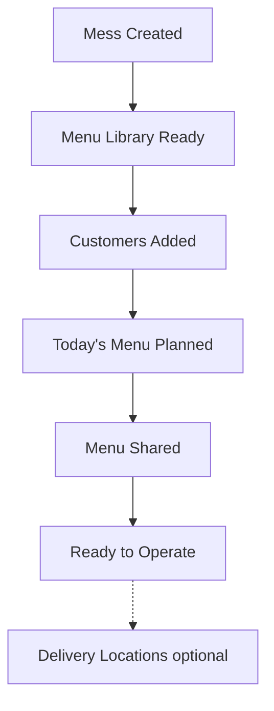

| Milestone | Kind | Why it exists | Done when | Primary CTA |
|-----------|------|---------------|-----------|-------------|
| Mess created | Required | Space exists | Space exists | — |
| Menu library ready | Required | Need reusable dishes before planning | Active items or combos | Open Menu Library |
| Customers added | Required | Someone must receive menus / confirmations | `memberCount > 0` | Add Customers |
| Today's menu planned | Required | Something to share today | ≥1 meal planned today | Plan Menu |
| Menu shared | Required | Customers only see menus after share | ≥1 meal published/modified today | Share Menu |
| Ready to operate | Derived | All required complete | All required done | Dashboard |
| Delivery locations | Recommended | Optional drop points | ≥1 delivery location | Add Delivery Locations |

**Allowed out-of-order work:** Owner may plan today’s menu before adding customers (Menu Planning allows it). Recommendation still prefers **Add Customers** first so Share is never the next tip while customers are missing.

### Dependency graph (recommendation)

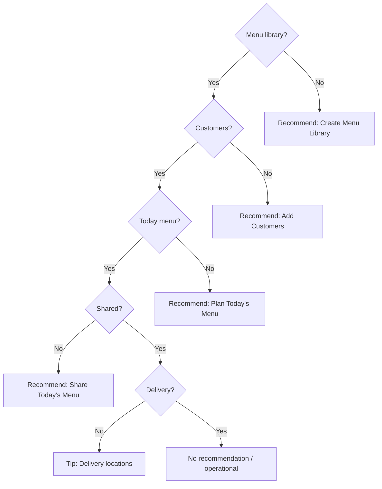

### Recommendation decision tree (cases)

| Library | Customers | Menu | Shared | Next recommendation | Reason (product) |
|---------|-----------|------|--------|---------------------|------------------|
| ❌ | — | — | — | Create Menu Library | Items required before planning meals |
| ✅ | ❌ | — | — | Add Customers | Needed before sharing today’s menu |
| ✅ | ✅ | ❌ | — | Plan Today's Menu | Customers ready — plan so they can receive |
| ✅ | ✅ | ✅ | ❌ | Share Today's Menu | Customers won’t receive until shared |
| ✅ | ✅ | ✅ | ✅ | Hidden (ops) / optional delivery tip | Mess ready |

Engine rule: walk **required** milestones in **profile order**, then recommended. Profile order encodes dependencies — no separate dependency DSL.

### Hero messaging (Mess)

| Stage | Hero subtitle |
|-------|----------------|
| New / library incomplete | Let’s get your mess ready. Only N step(s) remain… |
| Next = Add Customers | Great start! Now add customers… |
| Next = Plan menu | Customers are ready. Plan today’s menu… |
| Next = Share | Everything is ready. Share today’s menu… |
| READY | Your mess is ready! Start managing meals and payments. |

### Menu Planning guidance

- **No eligible meal members:** contextual card — can still plan; cannot share until customers are added. CTAs: **Add customers** / **Continue planning**.
- **Share with zero eligible members:** friendly alert → Add customers / Cancel (no technical errors).
- **Day status line:** business copy (“hasn’t been planned / hasn’t been shared”) instead of “0 shared · 0 not shared · 3 empty”.

### Share Menu prerequisites

1. At least one meal planned for the date (button otherwise disabled).
2. For Mess: ≥1 active meal member (`distinctEligibleMemberCount > 0`); otherwise block with enroll CTA.
3. Publish via existing `MenuSharePreview` flow.

### Empty-state strategy

- Setup progress: business labels (no Required/Recommended badges on Mess).
- Financial: “No payments yet…” while setup softens financial.
- Meal ops: guided empty during setup chrome.
- Menu Planning day strip: action-oriented hints.

### Lifecycle transitions (Mess)

| From | To | When |
|------|----|------|
| NEW | SETUP_IN_PROGRESS | First library/customers/menu signal |
| SETUP_IN_PROGRESS | READY | All **required** done (includes Menu Shared) |
| READY | ACTIVE | Dashboard operational signal (e.g. payments) — not menu alone |
| READY/ACTIVE | NEEDS_ATTENTION | Pending actions > 0 |

Setup chrome + Mess setup quick actions hide when required complete. Delivery remains a soft recommended tip from the engine (not blocking READY).

### Dashboard visibility (Mess-only deltas)

During **NEW / SETUP_IN_PROGRESS**:

- Show setup chrome (Next Step + progress)
- Show financial (softened) + meal operations + Mess setup QAs (Library → Customers → Plan → Share)
- Hide full operational quick actions and accommodation ops

When **READY / ACTIVE / NEEDS_ATTENTION**:

- Hide setup chrome and Mess setup quick actions
- Show normal Mess operational dashboard

### Screens / files touched

- `src/spaceLifecycle/profiles.ts` (milestone order + MENU_SHARED required)
- `src/spaceLifecycle/recommendation.ts` (Mess copy stems)
- `src/hooks/useSpaceLifecycleSignals.ts` (ACTIVE not from menu alone)
- `src/screens/dashboard/DashboardScreen.tsx` (hero + setup QAs)
- `src/components/dashboard/DashboardSetupProgressCard.tsx` (hide kind badges for Mess)
- `src/screens/meals/MenuPlanningScreen.tsx` (contextual enroll + share guard)
- `src/components/meals/MenuPlanningDayOverview.tsx` (business day status)
- `src/i18n/locales/en.json`
- Unit tests under `src/spaceLifecycle/__tests__/`

**Backend:** No backend changes required.

### Shared Business Progress Stepper (Dashboard Design System)

**Component:** `BusinessProgressStepper` (`src/components/dashboard/shared/BusinessProgressStepper.tsx`)

Horizontal onboarding stepper used by `DashboardSetupProgressCard` for **all** space types. Callers pass `steps[]` + `currentStepIndex` — no Mess-specific logic inside the stepper.

| State | Visual |
|-------|--------|
| Completed | Green filled circle + white check; green connector |
| Current | White circle, green border, step number |
| Future | Gray border, gray number, gray connector |

**Related shared cards**

| Component | Role |
|-----------|------|
| `DashboardChoiceCard` | Primary / secondary action cards (Add / Import) |
| `DashboardTipCard` | Yellow tip callout |
| `DashboardReasonCard` | “Why …” icon rows |
| `DashboardOrDivider` | Centered OR divider |
| `DashboardInfoBanner` | Summary banner + count pill |
| `DashboardPersonCard` | Import person row (avatar, source, role, status, Add) |
| `DashboardAvatar` / `DashboardRoleChip` / `DashboardStatusChip` | Person card primitives |

**Mess Add Customers flow**

1. `AddCustomersHub` — hero + stepper + Add customers / Import from other spaces  
2. `ImportExistingPeople` — filters, search, person cards (From: space; Available / Current Resident; + Add)  
3. `AddMember` (`initialMode: 'new'`) — create new customer  

Lifecycle / recommendation engines unchanged. `ADD_MEMBER` maps to `AddCustomersHub` when `spaceType === 'MESS'`.

**Future:** PG / Hostel / Rental / Co-living reuse the same stepper with their milestone labels.

---

## Implementation Roadmap

Execution plan for implementing this design. **Do not expand phase scope** without updating this section and re-checking acceptance criteria.

### Phase overview

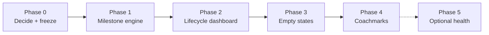

| Phase | In v1 default ship? | Depends on | Status |
|-------|---------------------|------------|--------|
| 0 — Decisions & freeze | Yes | Design approval | ✅ Completed (defaults applied) |
| 1 — Lifecycle engine foundation | Yes | Phase 0 | ✅ Completed (no UI) |
| 2 — Lifecycle dashboard + Next Step UI | Yes | Phase 1 | ✅ Completed |
| Mess Guided Setup (profile + Mess dashboard polish) | Yes | Phase 2 | ✅ Completed |
| 3 — Contextual empty states | Yes | Phase 1; Phase 2 preferred | 🟡 Partial (Mess hints done) |
| 4 — Coachmarks | Yes (thin) | Phase 2 | ✅ Completed |
| 5 — Health Score / enterprise | **No** portfolio; Health Score **yes** (secondary) | Phase 2 + product ask | ✅ Health Score complete; enterprise rollup deferred |

---

### Phase 0 — Decisions & scope freeze

**Status:** ✅ Completed (Phase 0 defaults applied in engine profiles)

#### Goal

Resolve blocking product questions, freeze v1 scope, and agree out-of-scope items so engineering does not invent behavior mid-flight.

#### Files to modify

| Path | Change |
|------|--------|
| `docs/Space-Onboarding-And-Lifecycle-Design.md` | Record Open Question decisions in this section / Open Questions |
| *(none in `src/`)* | No app code |

#### Components affected

None (process only).

#### Risks

| Risk | Mitigation |
|------|------------|
| Unresolved Rental+Meals / member filter debates stall Phase 1 | Default decisions below if owners don’t reply in time |
| Scope expands into Health Score or new APIs | Explicitly mark Phase 5 optional; reject mid-phase adds |

**Default decisions applied in Phase 1 engine:**

1. Rental: **omit** MEALS_READY from setup profile.  
2. RESIDENTS_READY: `memberCount > 0` (caller-supplied count).  
3. ACTIVE: requires `hasOperationalSignal === true` (Phase 2 soft-graduate).  
4. Optional meals tips: dismissible via `dismissedOptionalMilestoneIds` per evaluation.

#### Rollback strategy

N/A (documentation only). Revert doc edits if decisions change before Phase 1 starts.

#### Regression checklist

- [x] Open Questions 1–3 and 6 have recorded answers (defaults above).  
- [x] Phase 5 confirmed out of v1.  
- [x] No new API or backend work approved for Phases 1–4.  
- [x] Create Space lock/nav behavior left as-is.

#### Acceptance criteria

- [x] Written decision log for blocking questions.  
- [x] Phase 1–4 scope locked; Phase 5 optional.  
- [x] Engineering started Phase 1 with defaults.

---

### Phase 1 — Space Lifecycle Engine foundation ✅

**Status:** ✅ Completed (foundation only — **no UI redesign**)

> **Scope adjustment vs earlier roadmap draft:** Phase 1 ships the domain engine + hook + tests only. Wiring Next Step UI / replacing the technical checklist on the dashboard is deferred to **Phase 2** so visible behavior stays unchanged.

#### Goal

Create the Space Lifecycle Engine behind the scenes without changing application-visible behavior. Existing setup progress UI, dashboard, and navigation continue to work exactly as before.

#### Files created / modified

| Path | Change |
|------|--------|
| `src/spaceLifecycle/types.ts` | Lifecycle / milestone / recommendation types |
| `src/spaceLifecycle/milestones.ts` | Canonical milestone catalog |
| `src/spaceLifecycle/profiles.ts` | Per–space-type profiles via capability gates |
| `src/spaceLifecycle/predicates.ts` | Pure business predicates |
| `src/spaceLifecycle/recommendation.ts` | Single next-action engine |
| `src/spaceLifecycle/lifecycle.ts` | Lifecycle state derivation |
| `src/spaceLifecycle/evaluate.ts` | `evaluateSpaceLifecycle` entry point |
| `src/spaceLifecycle/compat.ts` | Legacy adapter + empty context helper |
| `src/spaceLifecycle/index.ts` | Public exports |
| `src/hooks/useSpaceLifecycle.ts` | Hook (unused by UI) |
| `src/spaceLifecycle/__tests__/*.test.ts` | Unit tests |
| `docs/Space-Onboarding-And-Lifecycle-Design.md` | Status + verification guide |

**Unchanged (by design):** `DashboardScreen`, `DashboardSetupProgressCard`, `useSpaceSetupProgress`, `spaceSetupProgress.ts`, Create Space, navigation.

#### Components affected

None in the running app. New domain module + unused hook only.

#### Risks

| Risk | Mitigation |
|------|------------|
| Accidental UI wiring | Explicitly did not import engine into Dashboard |
| Profile drift from `SPACE_TYPE_VALUES` | `LIFECYCLE_SPACE_TYPES` mirrored; tests assert full coverage |
| Jest + i18n import graph | Profiles avoid `api/spaceTypes` (i18n) |

#### Rollback strategy

1. Delete `src/spaceLifecycle/` and `src/hooks/useSpaceLifecycle.ts`.  
2. Revert doc status sections.  
3. No UI rollback needed (no consumers).

#### Regression checklist

- [x] Unit tests pass for all five space types.  
- [x] Legacy `buildSpaceSetupProgress` tests still pass.  
- [x] No dashboard/setup card file changes.  
- [ ] Manual: app dashboard looks identical (see Verification Guide).  
- [ ] Manual: Create Space / Accommodation / Members / Meals unchanged.

#### Acceptance criteria

- [x] Engine evaluates milestones, recommendation, lifecycle purely from `PredicateContext`.  
- [x] Profiles match design (Mess meals-first; Rental no meals; lodging optional meals).  
- [x] `useSpaceLifecycle` available but not consumed by UI.  
- [x] No new backend APIs.  
- [x] No visible UI / navigation changes in this PR.  
- [x] Design doc updated (status, roadmap, verification guide).

---

### Phase 2 — Lifecycle-aware dashboard + business Next Step UI

**Status:** ✅ Completed

#### Goal

**Done.** Consume `evaluateSpaceLifecycle` / `useSpaceLifecycle` on the owner dashboard: replace technical checklist with business milestones + Next Step card; soft-mute ops widgets during SETUP. Keep Create Space landing behavior.

#### Files to modify (planned)

| Path | Change |
|------|--------|
| `src/screens/dashboard/DashboardScreen.tsx` | Consume lifecycle hook / evaluation |
| `src/components/dashboard/DashboardSetupProgressCard.tsx` | Business milestone UI |
| `src/hooks/useSpaceSetupProgress.ts` | Build `PredicateContext` from existing fetches; feed engine |
| `src/i18n/locales/en.json` | Milestone title/reason/CTA strings |

See **Phase 2 Implementation Summary** and **Phase 2 Verification Guide** below for what shipped.

---

### Phase 2 — Lifecycle-aware dashboard composition

**Status:** ✅ Completed (merged with Next Step UI in the same ship)

#### Goal

Drive owner dashboard chrome from lifecycle state **and** replace the technical setup checklist with business milestones + Next Recommended Step (consuming Phase 1 engine). Emphasize setup during `NEW` / `SETUP_IN_PROGRESS`; show full ops when `READY` / `ACTIVE`; elevate Pending Actions when `NEEDS_ATTENTION` without replacing attention SoT.

#### Files to modify

| Path | Change |
|------|--------|
| `src/spaceLifecycle/evaluate.ts` (or equivalent) | Expose `lifecycleState` + widget visibility helpers |
| `src/screens/dashboard/DashboardScreen.tsx` | Conditional financial / accommodation / meal ops / QA by lifecycle |
| `src/components/dashboard/shared/DashboardOwnerHero.tsx` | Subtitle / emphasis by lifecycle (minimal) |
| `src/components/dashboard/DashboardFinancialSnapshot.tsx` | Optional muted/soft mode prop **only if needed** |
| `src/components/dashboard/DashboardAccommodationOperations.tsx` | Gate render from parent (prefer parent-only changes) |
| `src/components/dashboard/DashboardMealOperations.tsx` | Gate render from parent |
| `src/utils/__tests__/*lifecycle*` | Visibility decision tests |

**Avoid:** Rewriting tenant/customer dashboard branches; changing Global Attention.

#### Components affected

- Owner dashboard layout  
- `DashboardOwnerHero`  
- Setup card placement vs ops widgets  
- `PendingActionsQuickCard` ordering when attention > 0

#### Risks

| Risk | Mitigation |
|------|------------|
| Layout flicker while buildings load | Don’t flip lifecycle until required signals resolved; skeleton |
| Hiding financial surprises owners | Soft-mute or keep financial always; hide only ops zero cards |
| Mess owners lose meal ops too early | Mess: show meal ops once MEALS_READY in progress or complete per Decision Table |
| Large DashboardScreen diff | Prefer visibility helper + early returns; no drive-by refactors |

#### Rollback strategy

1. Revert dashboard composition PR; keep Phase 1 engine.  
2. Force `lifecycleState` helper to always return `ACTIVE` for widget visibility (kill-switch) while keeping Next Step card.

#### Regression checklist

- [ ] SETUP lodging: Next Step visible; occupancy ops hidden or de-emphasized until PROPERTY_READY.  
- [ ] SETUP Mess: Next Step visible; no Accommodation widgets.  
- [ ] READY/ACTIVE: setup card hidden; financial + ops + QA as today.  
- [ ] Pending count > 0: pending card visible; setup still primary only while SETUP.  
- [ ] Tenant / customer / meal-participant dashboards unchanged.  
- [ ] Pull-to-refresh still reloads summary + setup signals.  
- [ ] PG with complete setup matches pre-Phase-2 ops layout.

#### Acceptance criteria

- [ ] Dashboard composition matches Decision Table “Dashboard widget visibility.”  
- [ ] No duplicate attention systems.  
- [ ] Tenant paths unchanged (screenshot or checklist).  
- [ ] Kill-switch or clean revert path documented in PR.

---

### Phase 3 — Contextual empty states

#### Goal

Align module empty states with business language and the same CTAs as the recommendation engine—no generic “No data found.”

#### Files to modify

| Path | Change |
|------|--------|
| `src/i18n/locales/en.json` | Module empty title/description/CTA keys by space family |
| `src/screens/accommodation/AccommodationHomeScreen.tsx` | Welcome / Start Setup copy (may already be close) |
| `src/screens/MembersScreen.tsx` | Residents vs customers empty + Add/Invite CTA |
| `src/screens/meals/*` (library / home as applicable) | Menu library empty → Open Library |
| `src/screens/payments/PaymentsScreen.tsx` | Soft empty when no collections yet (owner) |
| `src/components/ui/EmptyState.tsx` | Optional `action` slot **only if** repeated CTA boilerplate demands it |

**Out of scope:** Redesigning list cards, filters, or FABs beyond empty copy/CTA.

#### Components affected

- Accommodation home empty  
- Members empty  
- Meals library / planning empty (where `EmptyState` or inline empty exists)  
- Payments owner empty (light touch)

#### Risks

| Risk | Mitigation |
|------|------------|
| i18n key sprawl across 6 locales | Update `en.json` first; rely on `fallbackLng` |
| Wrong CTA for read-only roles | Gate buttons with existing permissions |
| Mess vs lodging copy mixed | Key by space family helpers, not ad-hoc strings |

#### Rollback strategy

Revert i18n + screen empty JSX; `EmptyState` API change (if any) behind optional props with defaults preserving old title/description-only usage.

#### Regression checklist

- [ ] Accommodation empty (manage): Welcome + Start Setup + Add Building.  
- [ ] Accommodation empty (view-only): no manage CTAs.  
- [ ] Members empty: Add/Invite when `canManageMembers`.  
- [ ] Mess meals empty: Configure menu library CTA.  
- [ ] Lodging meals empty: does not claim meals are mandatory.  
- [ ] Filtered-empty states still distinct from first-time empty.  
- [ ] Rental accommodation empty never mentions beds.

#### Acceptance criteria

- [ ] First-time empties answer why + next action.  
- [ ] CTAs match Phase 1 navigation targets.  
- [ ] No permission leaks on CTAs.  
- [ ] en copy reviewed; no blocking missing keys in default language.

---

### Phase 4 — Lightweight coachmarks

#### Goal

One-time ≤3-step orientation on first land after create (or first SETUP visit), persisted locally—not a tour on every screen.

#### Status

✅ **Completed** (2026-07-25)

#### Files

| Path | Change |
|------|--------|
| `src/utils/coachmarkStorage.ts` | Persist `{spaceId, tourId}` completion (`completed` \| `skipped`) |
| `src/coachmarks/*` | Provider, visibility, sequences, types |
| `src/components/coachmarks/*` | Overlay, Card, Anchor, Sequence |
| `src/screens/accommodation/AccommodationHomeScreen.tsx` | `setup.accommodation.v1` when empty + owner + eligible lifecycle |
| `src/screens/dashboard/DashboardScreen.tsx` | `setup.mess.v1` for Mess SETUP |
| `src/components/dashboard/DashboardSetupProgressCard.tsx` | Optional coachmark anchors |
| `App.tsx` | `CoachmarkProvider` |
| `src/i18n/locales/en.json` | Tour step strings |
| Unit tests | `coachmarkStorage`, `visibility`, `sequences` |

**Out of scope (unchanged):** React Joyride, per-tab tours, replay UI (settings hook can be Phase 5+), Health Score, backend.

#### Regression checklist

- [x] First create PG: coachmark ≤3 steps on Accommodation; then never again for that space.  
- [x] First create Mess: coachmark on Dashboard only.  
- [x] Skip dismisses and persists.  
- [x] Returning ACTIVE user: no coachmark.  
- [x] Setup Next Step still usable if coachmark disabled (`ENABLE_SETUP_COACHMARKS`).  
- [x] No interaction with Pending Actions / bell.  
- [x] Progressive Guided Workflow unchanged.

#### Acceptance criteria

- [x] Coachmarks appear at most once per space per tour id.  
- [x] ≤3 steps; Skip works.  
- [x] Kill-switch constant available.  
- [x] No dependency on web Joyride libraries.

---

### Phase 5 — Space Health Score *(secondary)* + optional enterprise rollup

#### Goal

Secondary explainable Space Health (0–100) on the owner dashboard — never replacing Next Step or Pending Actions. Enterprise / My Spaces portfolio rollup remains deferred.

#### Status

✅ **Health Score completed** (2026-07-25) · ⬜ Enterprise portfolio deferred

#### Files

| Path | Change |
|------|--------|
| `src/spaceLifecycle/health/*` | Weights, signals, calculator, `useSpaceHealth` |
| `src/components/dashboard/DashboardSpaceHealthCard.tsx` | Secondary widget |
| `src/screens/dashboard/DashboardSpaceHealthScreen.tsx` | Breakdown (Setup / Ops / Attention) |
| `src/screens/dashboard/DashboardScreen.tsx` | Widget placement after setup card |
| `src/navigation/MainNavigator.tsx` + `types.ts` | `DashboardSpaceHealth` route |
| `src/i18n/locales/en.json` | `dashboard.health.*` |
| Unit tests | `health/__tests__/healthCalculator.test.ts` |

**Out of scope:** My Spaces “Needs setup” filter/badge, backend persistence, new APIs, gamification.

#### Components affected

Owner Dashboard only (secondary card); breakdown stack screen. Next Step + Pending Actions unchanged as primary.

#### Risks

| Risk | Mitigation |
|------|------------|
| Confuses setup % with attention | Cap while setup incomplete; Pending Actions remain SoT |
| Vanity 0% on new spaces | `available: false` empty state |
| Scope creep into backend | Client aggregate from existing signals only |

#### Rollback strategy

Hide widget (stop rendering `DashboardSpaceHealthCard`); engine remains pure and unused.

#### Regression checklist

- [x] Pending Actions badges unchanged.  
- [x] SETUP spaces still show Next Step, not only a score.  
- [x] Formula documented and unit-tested.  
- [x] Progressive Guided Workflow / Coachmarks unchanged.  
- [x] No new lifecycle states or APIs.

#### Acceptance criteria

- [x] Score is secondary; Next Step + Pending Actions remain primary.  
- [x] Every deduction has an explanation factor.  
- [x] Suggestions reuse Recommendation Engine.  
- [x] No new attention SoT.  
- [ ] Enterprise portfolio — deferred.

#### Manual test guide

1. Brand-new PG → empty health copy (no 0%).  
2. Setup in progress (building added) → score ≤ 69 with setup factors.  
3. Mess READY with clear pending → Healthy/Excellent band + positive factors.  
4. NEEDS_ATTENTION with pending → lower Attention category + Open Pending CTA on breakdown.  
5. Tap widget → breakdown shows Setup / Operations / Attention weights.  
6. Confirm Next Step card and Pending Actions still primary.

---

### Cross-phase engineering rules

1. **One phase per PR series** (stacked PRs OK; don’t merge Phase 2 before Phase 1 acceptance).  
2. **No drive-by refactors** outside listed files.  
3. **Tests first for profiles** (Phase 1 decision tables).  
4. **Manual QA matrix:** PG, HOSTEL, CO_LIVING, RENTAL, MESS × create → setup → ready.  
5. **Rollback:** prefer kill-switch for UI chrome; git revert for engine mistakes.  
6. **Stop ship if:** duplicate space creation regresses, or Accommodation auto-open loops, or tenant dashboard breaks.

### Suggested QA owners per phase

| Phase | Eng focus | Product / design focus |
|-------|-----------|-------------------------|
| 0 | — | Decisions |
| 1 | Engine + unit tests (no UI) | Confirm profiles match product |
| 2 | Dashboard composition + Next Step UI | “Does this feel like ops yet?” |
| 3 | Empty CTAs | Tone / why lines |
| 4 | Overlay + persistence | Step count / annoyance |
| 5 | Score math | Whether to ship at all |

---

## Phase 1 Verification Guide

### Build verification

```bash
npm test -- --testPathPattern="spaceLifecycle|spaceSetupProgress" --no-coverage
```

- [ ] Project compiles / Metro starts as usual.  
- [ ] No TypeScript errors in `src/spaceLifecycle/**`.  
- [ ] Unit tests above pass (expect 30+ tests).  
- [ ] Legacy setup progress tests still pass.

### Regression testing (manual — UI must be unchanged)

Verify **no visible difference** vs pre–Phase 1:

1. **Dashboard** — Owner PG space: setup card (technical steps) still appears if incomplete; financial / ops / quick actions unchanged.  
2. **Setup progress** — Still shows create building / floors / rooms / beds style steps (legacy).  
3. **Create Space** — Save disabled while submitting; single space created; success toast; lands Accommodation (lodging) or Dashboard (Mess).  
4. **Navigation** — Tabs and stack behavior unchanged.  
5. **Accommodation** — Empty Welcome / Start Setup unchanged.  
6. **Members / Meals** — Unchanged flows.

### Functional verification (engine — no production UI)

Phase 1 has **no production UI surface**. Verify the engine via unit tests and optional temporary DevTools usage:

**A. Unit tests (preferred)**

```bash
npm test -- --testPathPattern=spaceLifecycle --no-coverage
```

Covers: profile selection per type, PROPERTY_READY beds vs units, Mess meals-first recommendation, permissions skip, NEEDS_ATTENTION vs SETUP, optional dismiss, no recommendation when complete.

**B. Optional temporary debug (do not ship)**

In a throwaway local-only snippet (remove before commit):

```ts
import { evaluateSpaceLifecycle, emptyPredicateContext } from './spaceLifecycle';
import { deriveSpacePermissions } from './utils/spacePermissions';

const spaceType = 'PG';
const result = evaluateSpaceLifecycle({
  spaceType,
  context: emptyPredicateContext(
    spaceType,
    deriveSpacePermissions('OWNER', spaceType),
    { buildingCount: 0 },
  ),
});
console.log('[lifecycle]', result.lifecycle, result.recommendation);
```

Expected for empty PG: `lifecycle === 'NEW'`, `recommendation.milestoneId === 'PROPERTY_READY'`.

**C. Hook**

`useSpaceLifecycle` is exported from `src/hooks/useSpaceLifecycle.ts` but **must not** be imported by Dashboard yet. Confirm with:

```bash
# Should return no matches under screens/components (except if you added debug)
rg "useSpaceLifecycle" src/screens src/components
```

### Expected result after Phase 1

| Should have changed | Should NOT have changed |
|---------------------|-------------------------|
| New `src/spaceLifecycle/` module | Dashboard appearance |
| New `useSpaceLifecycle` hook (unused) | Setup progress card content |
| Unit tests | Create Space / navigation |
| This design doc status sections | Empty states / coachmarks |
| | Network call patterns on dashboard |

### Architecture (Phase 1 module)

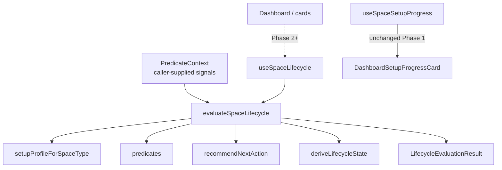

---

## Phase 2 Implementation Summary

### What shipped

Owner Dashboard is now a **consumer** of the Phase 1 Space Lifecycle Engine:

1. `useSpaceLifecycleSignals` loads buildings / summaries / members / menu catalog / Mess delivery locations (lazy by stage).
2. Builds pure `PredicateContext` (plus pending count + operational signal from existing dashboard data).
3. `useSpaceLifecycle` → `evaluateSpaceLifecycle` → recommendation + lifecycle + progress.
4. `DashboardSetupProgressCard` shows **Next Recommended Step** + **business milestones** (no Create Floor/Room/Bed rows).
5. Widget visibility follows `dashboardVisibilityForLifecycle`.
6. Continue CTA uses `mapSetupNavigationTarget` → existing tabs/stack screens only.

### Frontend files changed / added

| Path | Change |
|------|--------|
| `src/hooks/useSpaceLifecycleSignals.ts` | **Added** — signal gathering for engine |
| `src/hooks/useSpaceLifecycle.ts` | Comment update (dashboard consumer) |
| `src/spaceLifecycle/dashboardVisibility.ts` | **Added** — visibility rules |
| `src/spaceLifecycle/navigation.ts` | **Added** — CTA → existing routes |
| `src/spaceLifecycle/index.ts` | Export visibility + navigation |
| `src/spaceLifecycle/__tests__/dashboardVisibility.test.ts` | **Added** |
| `src/screens/dashboard/DashboardScreen.tsx` | Engine integration + visibility |
| `src/components/dashboard/DashboardSetupProgressCard.tsx` | Business milestone UI |
| `src/components/dashboard/shared/DashboardOwnerHero.tsx` | Optional subtitle |
| `src/utils/spaceSetupProgress.ts` | `aggregateBuildingStructure` includes `units` |
| `src/utils/__tests__/spaceSetupProgress.test.ts` | Units in aggregate assert |
| `src/i18n/locales/en.json` | Setup + `spaceLifecycle.milestones.*` copy |
| `docs/Space-Onboarding-And-Lifecycle-Design.md` | Status / summary / verification |

**Left in place (unused by Dashboard):** `useSpaceSetupProgress` + `buildSpaceSetupProgress` (legacy; safe to remove in a later cleanup).

### Navigation changes

No new routes. CTA maps:

| Engine target | Destination |
|---------------|-------------|
| `QUICK_SETUP` | `QuickSetupWizard` |
| `BUILDING_FORM` | `BuildingForm` (create) |
| `ACCOMMODATION_HOME` | Accommodation tab |
| `ADD_MEMBER` | `AddMember` |
| `MEMBERS` | Members tab |
| `MENU_LIBRARY` | `MenuLibrary` |
| `MENU_PLANNING` | `MenuPlanning` |
| `DELIVERY_LOCATIONS` | `MealDeliveryLocations` |
| `PENDING_ACTIONS` | `DashboardPendingActions` |

### Backend changes

**No backend changes required.**

### Performance considerations

- Lodging with 0 buildings: members only (no catalog / summaries).
- Catalog + summaries after buildings exist (or always for Mess).
- Delivery locations fetched only for Mess (`servingLocationMode === 'delivery'`).
- Operational signal reused from dashboard accommodation/financial already in memory.
- Pending count reused from existing dashboard / cache peeks.

### Known limitations

- Mess “Residents ready” copy is generic “members” (not “customers”) in Next Step title.
- `ACTIVE` requires occupied beds / move-ins / collected payments; brand-new READY spaces stay READY until ops activity.
- Optional meal tips still appear after required complete until catalog exists or tip is dismissed (dismiss storage not wired in UI yet).
- Legacy `useSpaceSetupProgress` still exists but is unused by Dashboard.

### Future work (not Phase 2)

- Phase 3: contextual empty states across modules  
- Phase 4: coachmarks  
- Optional dismiss persistence for optional milestones  
- Remove legacy setup progress module once unused

### Lifecycle UI descriptions (expected)

| State | What owner sees |
|-------|-----------------|
| **NEW** | Hero (setup subtitle) + Next Step + milestone progress; financial softened; no occupancy/meal ops; limited QA |
| **SETUP_IN_PROGRESS** | Same as NEW after first progress (e.g. building exists but beds/members incomplete) |
| **READY** | Setup chrome hidden; full financial + ops + meal ops + quick actions |
| **ACTIVE** | Same as READY (after operational signal) |
| **NEEDS_ATTENTION** | Same as READY/ACTIVE; Pending Actions card still first in quick actions (SoT unchanged) |

---

## Phase 2 Verification Guide

### Build verification

```bash
npm test -- --testPathPattern="spaceLifecycle|spaceSetupProgress" --no-coverage
```

Expected: all suites pass (36+ tests).

### Manual UI testing checklist

#### 1. Create Space

| Type | Landing | Expected |
|------|---------|----------|
| PG / Hostel / Co-living / Rental | Accommodation (if empty) | Single space; no crash; Welcome / Start Setup |
| Mess | Dashboard | Next Step → menu library |

- [ ] Save disabled while submitting; no duplicates  
- [ ] Success toast appears  

#### 2. Dashboard — every space type

- [ ] **PG empty:** Next = Get your property ready; milestones show Property / Residents / Meals (optional); no technical floor/bed rows  
- [ ] **Rental:** No Meals milestone; Property ready via units  
- [ ] **Mess:** No Property milestone; Next = Configure menu library; Delivery recommended after required  
- [ ] Progress % uses **required** milestones only  
- [ ] Continue opens correct existing screen  

#### 3. Navigation CTAs

- [ ] Continue Setup → Quick Setup / Accommodation path works  
- [ ] Add Members → Add Member screen  
- [ ] Open Menu Library → Menu Library  
- [ ] Add Delivery Locations (Mess) → Delivery Locations  

#### 4. Lifecycle transitions

- [ ] Empty space → NEW / SETUP with setup chrome  
- [ ] After property + members (lodging) → setup chrome gone (READY/ACTIVE)  
- [ ] With pending actions after ready → NEEDS_ATTENTION; pending card still works  
- [ ] Bell / Global Attention unchanged  

#### 5. Recommendation updates

- [ ] After Quick Setup / beds → next becomes Add members  
- [ ] After members → optional meals (lodging) or delivery (Mess)  
- [ ] After meals library (Mess) → customers / delivery  

#### 6. Existing features regression

- [ ] Accommodation / Quick Setup / Builder  
- [ ] Members / Add Member  
- [ ] Meals / Menu Planning / Menu Library  
- [ ] Payments / Complaints  
- [ ] Notifications / Pending Actions  
- [ ] Quick Actions (when READY+)  
- [ ] Tenant / customer dashboards unchanged  

#### 7. Regression — ops widgets

- [ ] Financial cards still load when visible  
- [ ] Occupancy cards when READY+  
- [ ] Meal operations when READY+ and meals managed  
- [ ] No duplicate pending cards  

#### 8. Performance

- [ ] Dashboard does not visibly thrash / flicker on focus  
- [ ] Pull-to-refresh still updates summary + setup signals  
- [ ] Empty lodging does not hammer menu catalog  

### Expected result after Phase 2

| Changed | Unchanged |
|---------|-----------|
| Owner setup card (business milestones) | Create Space flow |
| Lifecycle-based ops visibility | Tenant/customer dashboards |
| CTA navigation from recommendation | Module screens themselves |
| Hero subtitle during setup | APIs / permissions / Pending SoT |

---

## Appendix A — Module boundaries (Phase 1 shipped)

```
src/spaceLifecycle/
  types.ts
  milestones.ts
  profiles.ts
  predicates.ts
  recommendation.ts
  lifecycle.ts
  evaluate.ts
  compat.ts
  index.ts
  __tests__/

src/hooks/useSpaceLifecycle.ts
```

UI continues to live under `components/dashboard/`; legacy setup under `utils/spaceSetupProgress.ts` until Phase 2.

## Appendix B — Copy tone

- Prefer verbs of outcome: “Get your property ready,” “Add residents,” “Configure your menu.”  
- Always include a one-line **why**.  
- CTA names match destination (“Start Setup,” “Add Resident,” “Open Menu Library”).

## Appendix C — Document history

| Version | Date | Notes |
|---------|------|-------|
| 0.1 | 2026-07-23 | Initial production design from codebase analysis + proposal refinement |
| 0.2 | 2026-07-23 | Added Implementation Roadmap (phases 0–5: goals, files, risks, rollback, regression, acceptance) |
| 0.3 | 2026-07-23 | Phase 1 completed: spaceLifecycle engine + tests; no UI; status + verification guide |
| 0.4 | 2026-07-23 | Phase 2 completed: dashboard consumes engine; business Next Step; visibility; verification guide |
