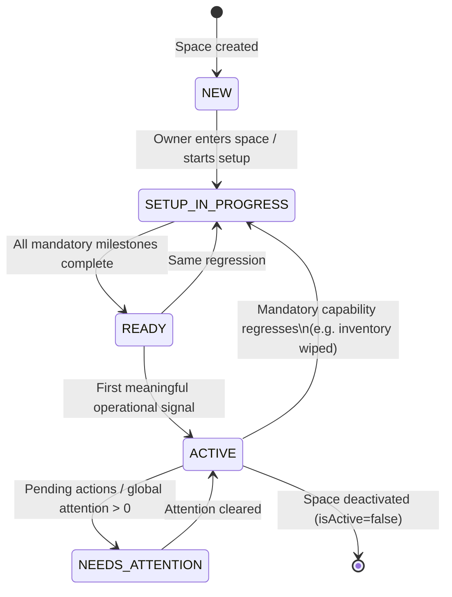
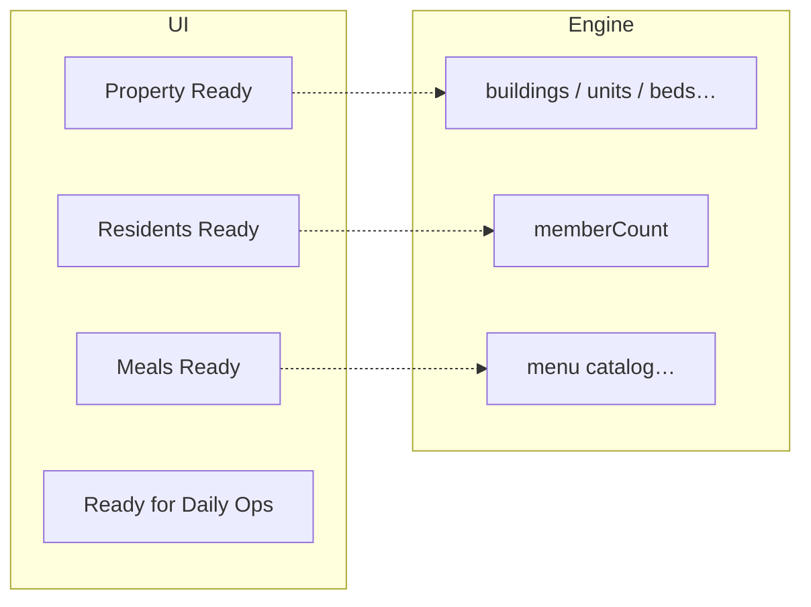
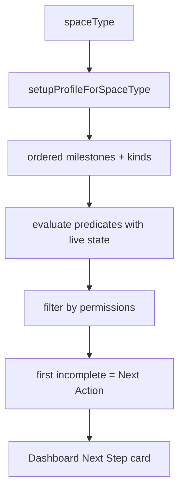
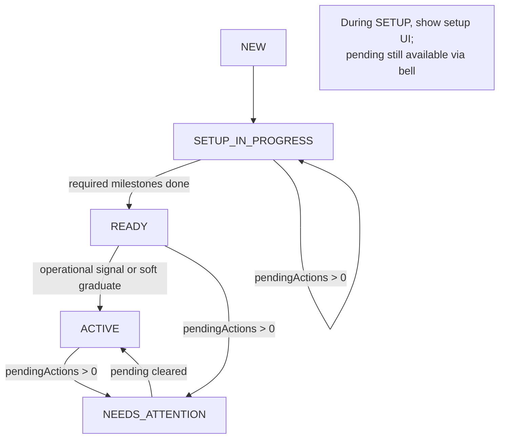
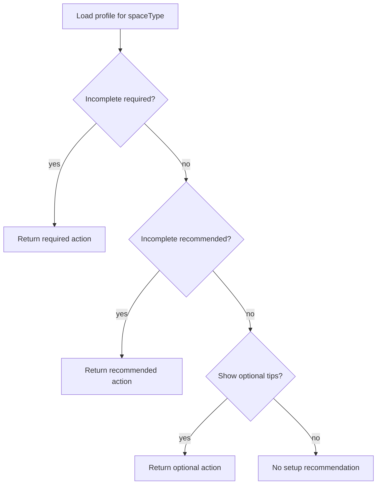
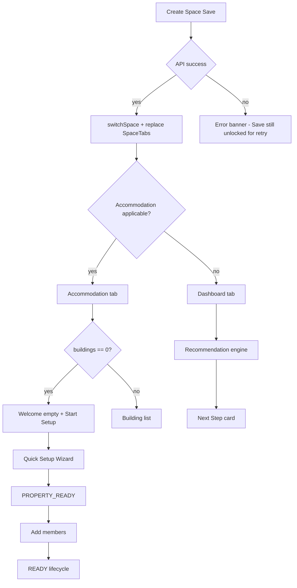
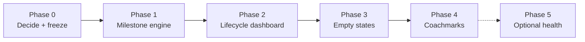

# Space Onboarding & Lifecycle Design

**Status:** Design proposal (no implementation)  
**Audience:** Product, design, engineering  
**Scope:** Owner/operator experience across all space types  
**Related:** `space-ui-integration.md`, `my-spaces-ui-integration.md`, `notification-event-catalog.md`, `accommodation-lifecycle-ui-integration.md`

---

## Executive Summary

CountIn already has the building blocks of onboarding and attention:

- Space-type gates (`isAccommodationApplicable`, meal/serving policies, member roles)
- Create-space → enter space flow
- A temporary technical setup checklist on the owner dashboard
- Pending Actions + Global Attention as the operational “needs attention” source of truth
- Module empty states and Quick Setup for property bootstrap

What is missing is a **business-oriented lifecycle model**: owners still see technical tasks (“add floors / beds”) and a one-size checklist that does not match Mess, Rental, or Co-living realities.

This document defines a **Space Lifecycle Engine** that:

1. Speaks in **business milestones** (Property Ready, Residents Ready, Meals Ready)—not technical CRUD steps.
2. Derives the **next recommended business action** from live state + existing feature gates.
3. Evolves the **dashboard** by lifecycle (setup vs operations vs attention).
4. Scales to new space types via **profiles**, without rewriting onboarding.
5. Reuses existing modules, permissions, APIs, and Pending Actions—**no parallel attention system**.

**Health Score vs Setup Progress:** Prefer a **Setup / Readiness Progress** driven by weighted milestones during onboarding, then switch to **operational attention signals** (Pending Actions) once ready. A single blended “Space Health %” is optional and secondary—see §12.

---

## Current Problems

| Problem | Evidence in product today |
|---------|---------------------------|
| “Now what?” after create | Empty dashboard zeros; property empty state lives on Accommodation, not always the landing path |
| Technical checklist | `spaceSetupProgress` exposes createBuilding / addFloors / addRooms / addBeds |
| Wrong steps per type | Rental asked for beds; Mess shown structure steps historically; meals treated as required for all |
| Feature-oriented UX | Owners navigate tabs instead of following a business outcome |
| Dual attention concepts | Setup incomplete vs Pending Actions / Global Attention not clearly sequenced |
| Inconsistent empty copy | Some modules use rich CTAs; others feel like “no data” |
| Hard to extend | New space type would require scattered `if (type === …)` changes |

---

## Goals

1. Always answer: **What should I do next?** and **Why?**
2. Make onboarding **space-type aware** and **permission aware**.
3. Separate **setup** from **daily operations** from **needs attention**.
4. Keep the dashboard contextual to lifecycle.
5. Reuse existing architecture; invent no duplicate workflows or APIs unless unavoidable.
6. Ship in phases with minimal rework.

### Non-goals

- Rewriting accommodation, meals, payments, or notification backends.
- Replacing Pending Actions / Global Attention.
- Joyride-style tours on every screen.
- Enterprise multi-property portfolio onboarding (future extension only).

---

## Design Principles

1. **Business over features** — Milestones describe outcomes (“Property Ready”), not entities (“Create Floor”).
2. **Discover, don’t assume** — Milestone applicability comes from existing gates (`accommodationProfile`, meal policies, roles).
3. **One recommendation** — Surface a single highest-priority next action; progress is secondary.
4. **Lifecycle over screens** — Dashboard composition follows lifecycle state, not a fixed widget list.
5. **Attention has one SoT** — Operational urgency = Pending Actions / Global Attention (`notification-event-catalog.md`).
6. **Internal vs external model** — Technical steps exist only inside the engine; UI never lists them as primary checklist items.
7. **Profiles, not forks** — Space types differ by **setup profile** data, not separate onboarding codepaths.
8. **Permissions first** — Never recommend a CTA the user cannot perform.

---

## Supported Space Types

Discovered canonical union (`src/api/types.ts`, `SPACE_TYPE_VALUES`):

| Code | Label | Product orientation |
|------|-------|---------------------|
| `PG` | PG (Paying Guest) | Bed lodging + optional meals |
| `HOSTEL` | Hostel | Same inventory model as PG |
| `CO_LIVING` | Co-living | Unit → room → bed |
| `RENTAL` | Rental (Flats / Rooms) | Unit-only inventory |
| `MESS` | Mess / Canteen | Meals-first; no accommodation |

No additional space types exist in the codebase today.

---

## Feature Matrix (capability gates)

Reuse these utilities; do not duplicate:

| Capability | Gate / source | PG | HOSTEL | CO_LIVING | RENTAL | MESS |
|------------|---------------|----|--------|-----------|--------|------|
| Accommodation | `isAccommodationApplicable` | ✓ | ✓ | ✓ | ✓ | ✗ |
| Layout default | `defaultLayoutModeForSpaceType` | Corridor PG | Corridor PG | Co-living | Rental | — |
| Allocatable target | `occupancyRules` | BED | BED | BED (/ROOM*) | UNIT | — |
| Quick Setup | Wizard steps by type | Full | Full | Full | No rooms step | Blocked |
| Amenities / gender policy | `supportsSpaceAmenities` / `supportsSpacePropertyCategory` | ✓ | ✓ | ✓ | ✗ | ✗ |
| Default member role | `defaultRoleForSpaceType` | TENANT | TENANT | TENANT | TENANT | CUSTOMER |
| Meals tab | Role `canViewMeals` | ✓ | ✓ | ✓ | ✓† | ✓ |
| Separate meal billing | `usesSeparateMealBilling` | ✗ | ✗ | ✗ | ✗ | ✓ |
| Serving locations | `servingLocationMode` | property | property | property | hidden | delivery |
| Menu share eligible | `isMealShareCompatibleSpace` | ✓ | ✓ | ✓ | ✗ | ✓ |
| Payments / Complaints | Role + category helpers | ✓ | ✓ | ✓ | ✓ | ✓ (mess categories) |

\*ROOM allocation for Co-living is allowed but marked unfinished—onboarding should not depend on it.  
†Rental meals exist in nav but share/serving are suppressed—treat meals as **out of setup** until product clarifies (Open Questions).

---

## Space Lifecycle

### States



| State | Meaning |
|-------|---------|
| **NEW** | Space exists; no meaningful setup yet (just created or never started). |
| **SETUP_IN_PROGRESS** | At least one mandatory milestone incomplete. |
| **READY** | Mandatory milestones complete; daily ops not yet “proven.” |
| **ACTIVE** | Space is operable and has shown operational use (or soft-graduate after READY + time/action). |
| **NEEDS_ATTENTION** | Overlay on READY/ACTIVE when Pending Actions / Global Attention require operator work. |

**Note:** `NEEDS_ATTENTION` is a **mode** layered on READY/ACTIVE, not a replacement for setup. Setup never competes with payment review urgency—attention wins on surfaces that already show badges.

### Transition rules (derived, client-side)

| From → To | Condition (reuse existing signals) |
|-----------|-------------------------------------|
| → NEW | Create space success; or open space with zero progress on mandatory milestones |
| → SETUP_IN_PROGRESS | Any mandatory milestone incomplete |
| → READY | All mandatory milestones complete; pending actions may still be 0 |
| → ACTIVE | READY **and** (`hasOperationalSignal` OR owner completed optional “Go to dashboard” after N days)—see Decision Table |
| → NEEDS_ATTENTION | `pendingActions.totalCount > 0` **or** My Spaces `needsAttention` for this space |
| ← SETUP | Inventory/members required signals drop below completion (rare) |
| Exit | `deactivateSpace` / removed from my spaces |

`hasOperationalSignal` (suggested, no new API required if we compose existing data):

- Any occupancy allocation, **or**
- Any payment in summary period, **or**
- Any meal poll/order activity, **or**
- Any complaint

If those are expensive on first paint, **ACTIVE can soft-equal READY** in v1 (graduate on first visit after READY). Documented as a phased choice.

### Per-state dashboard composition

| Surface | NEW / SETUP_IN_PROGRESS | READY | ACTIVE | NEEDS_ATTENTION |
|---------|-------------------------|-------|--------|-----------------|
| **Hero** | Welcome + space name; setup-oriented subtitle | “You’re ready” / ops subtitle | Standard `DashboardOwnerHero` | Hero + attention emphasis OR pending banner |
| **Primary card** | Next Recommended Action | Optional soft tips (optional milestones) | Hidden onboarding | Pending Actions card (existing) |
| **Setup Progress** | Visible (milestones) | Hidden (or collapsed “Improve setup”) | Hidden | Hidden |
| **Financial snapshot** | Optional / muted | Visible | Visible | Visible |
| **Accommodation ops** | Hide or dim until Property Ready | Visible if applicable | Visible | Visible |
| **Meal ops** | Hide until Meals milestone relevant / Mess mandatory | Visible if meals managed | Visible | Visible |
| **Quick Actions** | Only setup-relevant CTAs | Full operator QA | Full operator QA | Pending-first + QA |
| **Empty states** | Setup-oriented | Soft “not used yet” | Operational empty | Attention deep-links |
| **Notifications / badges** | Low priority | Normal | Normal | Bell + tab badges (existing) |
| **Recommended CTA** | Engine top action | Optional engine tip or none | None (ops) | Top pending action group |

### Landing screen after create / first open

| Space type | Landing | Why |
|------------|---------|-----|
| PG, HOSTEL, CO_LIVING, RENTAL | Accommodation tab (once if property incomplete) | Inventory unlocks everything else |
| MESS | Dashboard (meals-oriented next step) | No accommodation; meals-first |

Aligns with current Create Space behavior (`isAccommodationApplicable`) and auto-open Accommodation storage flag.

---

## Business Milestones

### Concept

**Milestone** = owner-facing business outcome.  
**Technical steps** = internal predicates + navigation targets (never primary UI).



### Canonical milestone catalog

| Milestone ID | Owner-facing name | Kind | Applies when |
|--------------|-------------------|------|--------------|
| `SPACE_CREATED` | Space created | Required (always done after create) | Always |
| `PROPERTY_READY` | Property ready | Required | `isAccommodationApplicable` |
| `RESIDENTS_READY` | Residents ready / Customers ready | Required | Always (copy by type) |
| `MEALS_READY` | Meals ready | Required for Mess; **Optional** for PG/Hostel/Co-living; **Omitted** for Rental (until clarified) | Gate: meals product rules |
| `DELIVERY_READY` | Delivery ready | Recommended (Mess) | `servingLocationMode === 'delivery'` |
| `OPS_READY` | Ready for daily operations | Derived | All required milestones complete |

### Internal technical mapping (engine only)

#### PROPERTY_READY

| Space type | Done when | Primary CTA target |
|------------|-----------|-------------------|
| PG / HOSTEL | `buildingCount > 0` **and** `beds > 0` (floors/rooms implied by bed graph) | Quick Setup / Accommodation |
| CO_LIVING | `buildingCount > 0` **and** `beds > 0` (via units→rooms) | Quick Setup / Accommodation |
| RENTAL | `buildingCount > 0` **and** `units > 0` | Quick Setup (3-step) / Accommodation |
| MESS | N/A (milestone omitted) | — |

Technical substeps (Progress detail drawer only, optional): Create building → structure → rooms/beds or units—as already implemented by Quick Setup.

#### RESIDENTS_READY

| Space type | Done when | CTA |
|------------|-----------|-----|
| Lodging types | `memberCount > 0` (tenants/customers as returned by `getMembers`) | Members / Add Member / Invite |
| MESS | `memberCount > 0` (customers) | Members / Add Member |

Copy: “Residents” vs “Customers” from space type.

#### MEALS_READY

| Space type | Kind | Done when | CTA |
|------------|------|-----------|-----|
| MESS | Required | Active menu library items **or** combos (`fetchSpaceMenuCatalog`) | Menu Library |
| PG / HOSTEL / CO_LIVING | Optional | Same library signal **or** first planned/shared menu (phase 2) | Menu Library / Menu Planning |
| RENTAL | Omitted | — | — |

#### DELIVERY_READY (Mess)

Done when ≥1 delivery location exists (existing Meal Delivery Locations module). Recommended, not mandatory for READY.

#### OPS_READY

Derived label when all **required** milestones for the profile are complete. Not a separate data fetch.

---

## Dynamic Recommendation Engine

### Responsibility

Given `(spaceType, permissions, liveState)` → return one **RecommendedAction**:

```ts
RecommendedAction {
  milestoneId: MilestoneId
  priority: number
  titleKey: string          // business language
  reasonKey: string         // why it matters
  ctaLabelKey: string
  navigation: NavigationTarget  // existing screens only
  kind: 'required' | 'recommended' | 'optional'
}
```

### Evaluation order (priority)

1. If user lacks permission for an action → skip (do not recommend).
2. Evaluate **required** milestones in profile order; return first incomplete.
3. Else evaluate **recommended** milestones in profile order.
4. Else evaluate **optional** milestones (soft tips; may be suppressed after dismiss).
5. Else → `null` (setup complete / no tip).

### Profile-driven, not hardcoded trees



`setupProfileForSpaceType` **composes** existing helpers:

- `isAccommodationApplicable`
- `getAccommodationUiProfile` / occupancy targets
- `servingLocationMode` / `usesSeparateMealBilling`
- `isMealShareCompatibleSpace` (for whether meals belong in profile)
- `resolveSpacePermissions`

Adding a future space type = new profile entry + gate updates—not a new onboarding feature.

### Example next-action outcomes

| Situation | Recommendation (business) | Navigate to |
|-----------|---------------------------|-------------|
| PG, no buildings | Continue setup — get your property ready | Quick Setup |
| PG, buildings but no beds | Continue setup — finish property layout | Accommodation / Builder |
| PG, property ready, no members | Add residents | Members / Add Member |
| PG, required done, no menu | Configure meals (optional) | Menu Library |
| Mess, no catalog | Configure your menu library | Menu Library |
| Mess, catalog, no customers | Add customers | Members |
| Mess, required done, no delivery | Add delivery locations (recommended) | Delivery Locations |
| Any, setup complete, pending > 0 | Do not show setup tip; show Pending Actions | Existing pending flow |

---

## Dashboard Evolution

### NEW / SETUP_IN_PROGRESS

```
┌ Hero: Good evening, {Space} ─────────────┐
├ Next: Get your property ready ───────────┤
│  Beds, residents, and payments depend    │
│  on this.                                │
│  [ Continue Setup ]                      │
├ Setup Progress ── 40% ████░░░░ ──────────┤
│  ✓ Space created                         │
│  ● Property ready      Required          │
│  ○ Residents ready     Required          │
│  ○ Meals ready         Optional          │
├ Financial (optional / muted) ────────────┤
└ Quick actions: only setup-related ───────┘
```

Hide or de-emphasize occupancy/meal operation cards until their milestone allows meaningful numbers (avoid “0 / 0 / 0” as the hero story).

### READY

```
┌ Hero: You're ready to operate ───────────┐
├ Optional tip (dismissible) ──────────────┤
├ This month (financial) ──────────────────┤
├ Property / Meal operations ──────────────┤
└ Quick Actions (full) ────────────────────┘
```

Onboarding card hidden. Optional milestone tips at most once.

### ACTIVE

Standard owner dashboard (current Design A): financial, ops, meal ops, quick actions. No setup chrome.

### NEEDS_ATTENTION

Same as ACTIVE/READY **plus**:

- Pending Actions quick card (existing) elevated
- Bell / tab badges unchanged (existing SoT)
- Setup card remains hidden

---

## Empty States

Principle: every empty module explains **why** and **what to do next**, aligned with the same recommendation engine where possible.

| Module | Setup-oriented empty | Ops-oriented empty |
|--------|----------------------|--------------------|
| **Accommodation** | Welcome — create property layout → Start Setup / Add Building | No buildings match filters / search |
| **Members** | No residents/customers yet → Add / Invite | No matches for filters |
| **Meals (library)** | No menu library — configure first → Open Library | — |
| **Meals (planning)** | Plan today’s menu → Plan Menu | Date has no plan |
| **Payments** | No payments yet — add residents / collect | Filter empty (existing) |
| **Complaints** | No complaints — good standing | Filter empty |
| **Delivery (Mess)** | Add delivery locations to take orders | — |

Reuse `EmptyState` + nearby `Button` pattern from Accommodation home; extend copy via i18n keys per space family (lodging vs mess).

---

## Setup Progress (UI)

### What owners see

- Milestone list (business names only)
- Overall **required** completion % (optional milestones excluded from denominator **or** shown separately)
- Visual bar
- Badges: Required / Recommended / Optional / Done

### What owners do **not** see

- Create floor / room / bed as peer checklist rows  
  (Optional “What’s left inside Property ready?” expansion can list substeps for power users—default collapsed)

### Distinction rules

| Kind | Affects READY? | Shown in %? | After READY |
|------|----------------|-------------|-------------|
| Required | Yes | Yes | Hidden with card |
| Recommended | No | Separate “Improve” section optional | Soft tip |
| Optional | No | Excluded from required % | Soft tip / dismiss |
| Completed | — | Counts toward % | — |

---

## Space Health Score (or alternative)

### Recommendation: **do not lead with a blended Health Score**

**Why not (as primary UX):**

1. **Setup readiness ≠ operational health.** A space can be 100% set up and still have 12 payments needing review.
2. CountIn already has a strong operational signal: **Pending Actions / Global Attention**.
3. Blending setup + attention into one % creates misleading “82% Healthy” while critical reviews wait.
4. Weighting optional meals against mandatory property inventory is product-political and hard to explain.

### Preferred model (two layers)

| Layer | Metric | When shown |
|-------|--------|------------|
| **Setup Readiness** | Required milestones complete / total required | NEW + SETUP_IN_PROGRESS |
| **Attention** | Pending action count + groups | READY / ACTIVE / always in My Spaces |

### Optional later: Space Health Score (secondary)

If stakeholders still want a score for enterprise dashboards:

```
Health = 0.6 * SetupReadiness
       + 0.4 * AttentionHealth
```

Where `AttentionHealth = 1 - saturate(pendingCount / threshold)`.

- Required milestones missing → cap Health at &lt; 70% regardless of attention.
- Optional milestones never reduce Health below READY threshold.
- Label bands: Needs setup / Ready / Healthy / Needs attention—not a vanity percentage alone.

**v1 ship without Health Score.** Use Setup Readiness % + Pending Actions.

---

## Coachmark Strategy

Lightweight, local, minimal—not React Joyride everywhere.

| Rule | Detail |
|------|--------|
| **When** | Once after first transition into a space that is NEW/SETUP, on the **landing screen only** (Accommodation or Mess Dashboard) |
| **Steps** | 3 max (e.g. Next Step card → primary CTA → tab that matters) |
| **Disappear** | After last step, Skip, or Outside dismiss |
| **Persistence** | AsyncStorage `@countin/coachmarks/{spaceId}/{tourId}` |
| **Never again** | Unless “Replay tips” in space settings (future) |
| **Not used for** | Every empty state, every tab, returning ACTIVE users |

Empty states + Next Step card carry ongoing guidance; coachmarks are orientation only.

---

## UI Wireframes (ASCII)

### Next Step + Progress (setup)

```
┌──────────────────────────────────────────┐
│ Getting started                          │
│                                          │
│ Next: Get your property ready            │
│ Inventory unlocks beds, residents, and   │
│ collections.                             │
│                                          │
│ [ Continue Setup ]                       │
│                                          │
│ Setup readiness            33%           │
│ ████░░░░░░░░                             │
│ ✓ Space created                          │
│ ● Property ready           Required      │
│ ○ Residents ready          Required      │
│ ○ Meals ready              Optional      │
└──────────────────────────────────────────┘
```

### Mess variant

```
│ Next: Configure your menu library        │
│ Customers need items before they can     │
│ order and pay.                           │
│ [ Open Menu Library ]                    │
│ ✓ Space created                          │
│ ● Meals ready              Required      │
│ ○ Customers ready          Required      │
│ ○ Delivery ready           Recommended   │
```

### READY / ACTIVE (ops)

```
┌ Hero ────────────────────────────────────┐
├ This month ── Expected / Collected / … ──┤
├ Property operations ── Occupied / Vacant ┤
├ Meal operations ─────────────────────────┤
├ Pending Actions (if any) ────────────────┤
└ Quick Actions ───────────────────────────┘
```

---

## State Diagrams

### Lifecycle (compact)



### Recommendation evaluation



---

## Decision Tables

### Milestone applicability

| Milestone | PG | HOSTEL | CO_LIVING | RENTAL | MESS |
|-----------|----|--------|-----------|--------|------|
| SPACE_CREATED | R | R | R | R | R |
| PROPERTY_READY | R | R | R | R | — |
| RESIDENTS_READY | R | R | R | R | R |
| MEALS_READY | O | O | O | —† | R |
| DELIVERY_READY | — | — | — | — | Rec |
| OPS_READY | derived | derived | derived | derived | derived |

R = required, O = optional, Rec = recommended, — = omit  
†Omit until Rental meals product decision.

### PROPERTY_READY predicate

| Type | Predicate |
|------|-----------|
| PG / HOSTEL / CO_LIVING | buildings ≥ 1 ∧ beds ≥ 1 |
| RENTAL | buildings ≥ 1 ∧ units ≥ 1 |
| MESS | omit |

### Post-create navigation

| Type | Initial tab | Coachmark tour id |
|------|-------------|-------------------|
| Accommodation types | Accommodation | `setup.accommodation.v1` |
| MESS | Dashboard | `setup.mess.v1` |

### Dashboard widget visibility

| Widget | SETUP | READY/ACTIVE | NEEDS_ATTENTION |
|--------|-------|--------------|-----------------|
| Next Step | ✓ | ✗ (optional tip only) | ✗ |
| Setup Progress | ✓ | ✗ | ✗ |
| Financial | soft | ✓ | ✓ |
| Accommodation ops | after PROPERTY_READY | ✓ | ✓ |
| Meal ops | Mess: after MEALS_READY start; others: if meals managed | ✓ | ✓ |
| Pending card | if count>0 | if count>0 | ✓ elevated |
| Full Quick Actions | limited | ✓ | ✓ |

---

## Navigation Flow



Deep links from Next Step use **existing** routes only:

- `QuickSetupWizard`, `BuildingForm`, `Accommodation` tab  
- `Members`, `AddMember`, `InviteMember`  
- `Meals` / Menu Library / Menu Planning  
- `MealDeliveryLocations`  
- `DashboardPendingActions`

---

## Component Reuse Strategy

| Need | Reuse / evolve |
|------|----------------|
| Next Step + Progress UI | Evolve `DashboardSetupProgressCard` → milestone-oriented API |
| Hero | `DashboardOwnerHero` (subtitle by lifecycle) |
| Empty + CTA | `EmptyState` + `Button` (Accommodation home pattern) |
| Property bootstrap | `QuickSetupWizardScreen`, builder screens |
| Members | Existing member flows |
| Meals | Menu library / planning screens |
| Attention | `PendingActionsQuickCard`, bell, Global Attention (unchanged SoT) |
| Auto-land Accommodation | `spaceSetupStorage` + Dashboard effect |
| Create success | Current Create Space lock + toast + replace navigation |

**Replace:** technical step list in `buildSpaceSetupProgress` with milestone evaluator (same hook surface can remain `useSpaceSetupProgress` → rename later to `useSpaceLifecycle` if desired).

---

## APIs Reused (no new APIs required for v1)

| Signal | API / client helper |
|--------|---------------------|
| Buildings | `accommodationApi.getBuildings` |
| Structure counts | `getBuildingSummary` (floors/units/rooms/beds) |
| Members | `memberApi.getMembers` |
| Meal library | `fetchSpaceMenuCatalog` |
| Pending actions | Existing pending-actions / dashboard-summary |
| Global attention | Existing global dashboard endpoints |
| Space session | `spaceStore` refresh / switchSpace / deactivate |

**Optional later (only if needed):** delivery-location count endpoint if not already listable; daily menu “has plan” peek—defer to phase 2 optional meals tip.

---

## Feature Gates Reused

- `isAccommodationApplicable`, `getAccommodationUiProfile`, `defaultLayoutModeForSpaceType`
- `layoutModesForSpaceType`, Quick Setup step lists
- `occupancyRules` (allocatable target)
- `defaultRoleForSpaceType`, `assignableRolesForSpaceType`
- `usesSeparateMealBilling`, `servingLocationMode`, `isMealShareCompatibleSpace`
- `canEnableMealsForMember` / meal permissions
- `resolveSpacePermissions` / `canManage*` flags
- `shouldShowDashboardMealOperations`
- Complaint `categoriesForSpaceType`

---

## Edge Cases

| Case | Behavior |
|------|----------|
| Create API succeeds, navigation fails | Toast success; keep submit locked; offer “Open space” retry using known `spaceId` |
| Double-tap Save | In-flight lock (already designed) |
| Staff without manage accommodation | Skip property CTAs; show read-only empty / permission denied |
| Mess user opens Accommodation | Tab absent; engine never recommends it |
| Rental with beds in backend unexpectedly | Still complete PROPERTY_READY on units; ignore beds in UI profile |
| Members list includes only staff | Treat RESIDENTS_READY incomplete until a resident/customer role exists (**Open Question**—may need role filter) |
| Optional meals dismissed | Persist dismiss; don’t block READY |
| Pending actions during SETUP | Bell works; dashboard can show pending card below Next Step without replacing it |
| Space deactivated | Leave lifecycle; My Spaces list drops space |
| Multi-building partial structure | PROPERTY_READY when **space-level** inventory predicate met (any allocatable inventory), not every building perfect |

---

## Future Extensibility

### New space type

1. Add to `SpaceType` + picker i18n.  
2. Declare gates (accommodation? meals? serving?).  
3. Add **setup profile** (ordered milestones + predicates + CTAs).  
4. No new onboarding screens unless a net-new module appears.

### New module (e.g. Assets, IoT)

1. Add milestone definition + predicate.  
2. Attach to profiles that need it (required/optional).  
3. Empty state + CTA to existing or new module screen.  
4. Engine picks it up automatically via profile order.

### Feature flags (when introduced)

Profiles should accept `flags: Record<string, boolean>` so milestones can be `applies: flags.mealsModule !== false`. Today gating is capability-driven only—design the profile interface to allow flags without rewrite.

### Enterprise

Portfolio-level “spaces needing setup” can aggregate `lifecycle === SETUP_IN_PROGRESS` using the same client evaluator or a future summary field—UI aggregation only; no change to per-space engine.

---

## Migration Strategy

High-level phases (detailed execution plan: **Implementation Roadmap** below):

| Phase | Deliverable | Risk |
|-------|-------------|------|
| **0** | Design accepted; freeze scope; resolve blocking Open Questions | — |
| **1** | Milestone engine + profiles; business-milestone UI; fix Rental/Mess predicates | Low |
| **2** | Lifecycle-aware dashboard composition | Medium |
| **3** | Contextual empty-state copy across modules | Low |
| **4** | Coachmarks (≤3 steps) on first land | Low |
| **5** | Optional Health Score / enterprise rollup | Optional — out of v1 default scope |

**Compatibility:** Evolve `useSpaceSetupProgress` behind adapters; keep Dashboard changes localized. Remove technical step IDs from user-visible i18n.

**No backend migration required for v1.**

**Scope-creep guardrails**

- Do not start Phase N+1 until Phase N acceptance criteria pass.
- Do not add Health Score, new APIs, Joyride, or portfolio onboarding in Phases 1–4.
- Do not invent a second attention system; Pending Actions remain SoT.
- Open Questions that block a phase must be decided in Phase 0 or deferred explicitly in that phase’s scope.
---

## Open Questions

1. **Rental + Meals:** Omit from setup (recommended) vs keep optional? Share/serving already exclude Rental.  
2. **RESIDENTS_READY member filter:** Any member vs only TENANT/CUSTOMER (exclude STAFF/MANAGER)?  
3. **ACTIVE vs READY:** Soft-graduate on first READY visit vs require operational signal?  
4. **Food bundled in rent (PG/Hostel):** Should MEALS_READY stay optional forever, or prompt once?  
5. **Co-living ROOM allocation:** When finalized, does PROPERTY_READY allow rooms without beds?  
6. **Dismiss optional tips:** Per-space vs per-user global?  
7. **Backend lifecycle field:** Useful later for My Spaces sorting; not required for v1 client derivation.

---

## Risks

| Risk | Mitigation |
|------|------------|
| Over-fetch on dashboard (summaries + catalog + members) | Lazy: only fetch what profile needs; skip catalog until property ready (non-Mess) |
| Owners ignore optional meals | Acceptable; Mess keeps meals required |
| Lifecycle flicker while loading | Hold Next Step until buildings loaded; skeleton on progress |
| Competing CTAs (setup vs pending) | Priority: permissioned pending only elevates in NEEDS_ATTENTION; during SETUP show both with setup primary |
| Profile drift from gates | Single module owning profiles; unit tests per space type |
| Android Fabric nav resets | Keep soft navigate / replace patterns already established |

---

## Challenges to the Previous Proposal

| Earlier idea | Update | Reason |
|--------------|--------|--------|
| Technical checklist as primary UI | Business milestones only | Matches “what next?” language |
| Meals required for all types | Mess required; lodging optional; Rental omit | Matches meal gates / share policy |
| Beds step for Rental | Units-based PROPERTY_READY | Matches `showBeds: false` / UNIT allocation |
| Floors/rooms as peer milestones | Internal to PROPERTY_READY | Less noise; Quick Setup already sequences them |
| Single progress % including optional | Required-only readiness % | Avoids fake incompleteness |
| Health Score as centerpiece | Defer; use readiness + Pending Actions | Attention SoT already exists |
| Joyride-level tours | 3-step coachmark once | Avoid annoyance |
| Static checklist order | Priority evaluator over profile | Scalable, permission-aware |

---

## Final Recommendation

Implement a **profile-driven Space Lifecycle Engine** with:

1. **Business milestones** as the only owner-facing setup model.  
2. **Dynamic next-action** evaluation from live state + existing gates.  
3. **Lifecycle-based dashboard** (setup chrome → ops chrome → attention overlay).  
4. **Pending Actions** as the sole operational attention system.  
5. **Setup Readiness %** (required milestones)—not a blended Health Score in v1.  
6. **Minimal coachmarks**; rich empty states; no Joyride sprawl.  
7. **Phased delivery** starting with the milestone engine and Mess/Rental predicate fixes.

This yields a production-ready architecture that stays space-oriented, reuses CountIn’s modules and gates, and extends to future space types without rewriting onboarding.

---

## Implementation Roadmap

Execution plan for implementing this design. **Do not expand phase scope** without updating this section and re-checking acceptance criteria.

### Phase overview



| Phase | In v1 default ship? | Depends on |
|-------|---------------------|------------|
| 0 — Decisions & freeze | Yes | Design approval |
| 1 — Milestone engine + Next Step UI | Yes | Phase 0 |
| 2 — Lifecycle dashboard composition | Yes | Phase 1 |
| 3 — Contextual empty states | Yes | Phase 1 (copy keys); Phase 2 preferred |
| 4 — Coachmarks | Yes (thin) | Phase 2 |
| 5 — Health Score / enterprise | **No** (optional) | Phase 2 + product ask |

---

### Phase 0 — Decisions & scope freeze

#### Goal

Resolve blocking product questions, freeze v1 scope, and agree out-of-scope items so engineering does not invent behavior mid-flight.

#### Files to modify

| Path | Change |
|------|--------|
| `docs/Space-Onboarding-And-Lifecycle-Design.md` | Record Open Question decisions in this section / Open Questions |
| *(none in `src/`)* | No app code |

#### Components affected

None (process only).

#### Risks

| Risk | Mitigation |
|------|------------|
| Unresolved Rental+Meals / member filter debates stall Phase 1 | Default decisions below if owners don’t reply in time |
| Scope expands into Health Score or new APIs | Explicitly mark Phase 5 optional; reject mid-phase adds |

**Default decisions if product is silent (v1):**

1. Rental: **omit** MEALS_READY from setup profile.  
2. RESIDENTS_READY: `memberCount > 0` as returned by `getMembers` (refine filter later).  
3. ACTIVE: **soft-equal READY** on first dashboard visit after required milestones complete.  
4. Optional meals tips: dismissible **per space**.

#### Rollback strategy

N/A (documentation only). Revert doc edits if decisions change before Phase 1 starts.

#### Regression checklist

- [ ] Open Questions 1–3 and 6 have recorded answers (or defaults above).  
- [ ] Phase 5 confirmed out of v1.  
- [ ] No new API or backend work approved for Phases 1–4.  
- [ ] Stakeholders agree Create Space lock/nav behavior from prior fix stays as-is in Phase 1 (no rewrites unless broken).

#### Acceptance criteria

- [ ] Written decision log for blocking questions.  
- [ ] Phase 1–4 scope locked; Phase 5 optional.  
- [ ] Engineering can start Phase 1 without further product meetings for defaults.

---

### Phase 1 — Milestone engine + business Next Step UI

#### Goal

Replace technical checklist steps with **profile-driven business milestones** and a single **Next Recommended Action**. Fix Mess / Rental / Co-living predicates so each space type only sees relevant milestones. Keep Create Space → land behavior; wire CTAs to existing screens.

#### Files to modify

| Path | Change |
|------|--------|
| `src/utils/spaceSetupProgress.ts` **or** new `src/spaceLifecycle/*` | Profiles, milestones, evaluator, lifecycle derivation |
| `src/hooks/useSpaceSetupProgress.ts` | Consume evaluator; fetch only signals required by profile |
| `src/utils/__tests__/spaceSetupProgress.test.ts` (+ new lifecycle tests) | Per–space-type decision tables |
| `src/components/dashboard/DashboardSetupProgressCard.tsx` | Next Step + milestone progress (required/optional badges) |
| `src/screens/dashboard/DashboardScreen.tsx` | Plumb new action shape / CTA routing by milestone |
| `src/i18n/locales/en.json` | Business milestone + reason + CTA strings (fallbackLng covers others) |
| `src/utils/spaceSetupStorage.ts` | Keep auto-open flag; no behavior change unless needed |

**Do not modify in this phase:** Quick Setup internals, Pending Actions, payments, meal APIs, tab navigator structure (unless CTA target missing).

#### Components affected

- `DashboardSetupProgressCard` (primary)  
- Owner `DashboardScreen` setup block  
- Indirect: navigation to Accommodation / Members / Meals / Quick Setup / Delivery (existing screens, no redesign)

#### Risks

| Risk | Mitigation |
|------|------------|
| Hook over-fetch (catalog + all summaries) | Lazy predicates: Mess loads catalog first; lodging skips catalog until PROPERTY_READY |
| Breaking existing setup card consumers | Adapter: map new evaluator → card props; keep export name temporarily |
| Wrong Rental completion (beds) | Unit tests for RENTAL profile: units-based PROPERTY_READY |
| CTA navigates to tab user cannot see | Filter by `resolveSpacePermissions` before recommending |

#### Rollback strategy

1. Revert PR(s) for `spaceLifecycle` / `spaceSetupProgress` + card + dashboard wiring.  
2. Restore previous technical checklist i18n keys if removed.  
3. Feature toggle (optional): `USE_MILESTONE_SETUP=false` local constant to force old `buildSpaceSetupProgress` path for one release if needed.

#### Regression checklist

- [ ] **PG:** no buildings → Next Step = Property ready → CTA opens Quick Setup or Accommodation.  
- [ ] **PG:** beds exist, no members → Residents ready → Members / Add Member.  
- [ ] **HOSTEL:** same as PG for milestones (copy may differ).  
- [ ] **CO_LIVING:** no “floors” as owner-facing milestone; PROPERTY_READY via beds.  
- [ ] **RENTAL:** no beds/meals milestones; PROPERTY_READY via units; completes without beds.  
- [ ] **MESS:** no property milestones; Meals ready required; lands Dashboard; CTA → Menu Library.  
- [ ] Required % excludes optional meals for lodging.  
- [ ] Create Space still disables Save, no duplicates, success toast, correct landing tab.  
- [ ] Auto-open Accommodation still once per empty lodging space.  
- [ ] Pending Actions bell/card still works during SETUP.  
- [ ] Staff without `canManageAccommodation` never gets Property CTA.  
- [ ] Unit tests: decision table for all five space types.

#### Acceptance criteria

- [ ] Owner UI shows **business milestones only** (no Create Floor/Room/Bed rows).  
- [ ] Single Next Step answers what / why / where.  
- [ ] Profiles match Feature Matrix (Mess omit property; Rental omit meals; lodging meals optional).  
- [ ] READY when all **required** milestones complete; card hides.  
- [ ] No new backend APIs.  
- [ ] Phase 1 PR(s) pass lint + targeted Jest.

---

### Phase 2 — Lifecycle-aware dashboard composition

#### Goal

Drive owner dashboard chrome from lifecycle state: emphasize setup during `NEW` / `SETUP_IN_PROGRESS`; show full ops when `READY` / `ACTIVE`; elevate Pending Actions when `NEEDS_ATTENTION` without replacing attention SoT.

#### Files to modify

| Path | Change |
|------|--------|
| `src/spaceLifecycle/evaluate.ts` (or equivalent) | Expose `lifecycleState` + widget visibility helpers |
| `src/screens/dashboard/DashboardScreen.tsx` | Conditional financial / accommodation / meal ops / QA by lifecycle |
| `src/components/dashboard/shared/DashboardOwnerHero.tsx` | Subtitle / emphasis by lifecycle (minimal) |
| `src/components/dashboard/DashboardFinancialSnapshot.tsx` | Optional muted/soft mode prop **only if needed** |
| `src/components/dashboard/DashboardAccommodationOperations.tsx` | Gate render from parent (prefer parent-only changes) |
| `src/components/dashboard/DashboardMealOperations.tsx` | Gate render from parent |
| `src/utils/__tests__/*lifecycle*` | Visibility decision tests |

**Avoid:** Rewriting tenant/customer dashboard branches; changing Global Attention.

#### Components affected

- Owner dashboard layout  
- `DashboardOwnerHero`  
- Setup card placement vs ops widgets  
- `PendingActionsQuickCard` ordering when attention > 0

#### Risks

| Risk | Mitigation |
|------|------------|
| Layout flicker while buildings load | Don’t flip lifecycle until required signals resolved; skeleton |
| Hiding financial surprises owners | Soft-mute or keep financial always; hide only ops zero cards |
| Mess owners lose meal ops too early | Mess: show meal ops once MEALS_READY in progress or complete per Decision Table |
| Large DashboardScreen diff | Prefer visibility helper + early returns; no drive-by refactors |

#### Rollback strategy

1. Revert dashboard composition PR; keep Phase 1 engine.  
2. Force `lifecycleState` helper to always return `ACTIVE` for widget visibility (kill-switch) while keeping Next Step card.

#### Regression checklist

- [ ] SETUP lodging: Next Step visible; occupancy ops hidden or de-emphasized until PROPERTY_READY.  
- [ ] SETUP Mess: Next Step visible; no Accommodation widgets.  
- [ ] READY/ACTIVE: setup card hidden; financial + ops + QA as today.  
- [ ] Pending count > 0: pending card visible; setup still primary only while SETUP.  
- [ ] Tenant / customer / meal-participant dashboards unchanged.  
- [ ] Pull-to-refresh still reloads summary + setup signals.  
- [ ] PG with complete setup matches pre-Phase-2 ops layout.

#### Acceptance criteria

- [ ] Dashboard composition matches Decision Table “Dashboard widget visibility.”  
- [ ] No duplicate attention systems.  
- [ ] Tenant paths unchanged (screenshot or checklist).  
- [ ] Kill-switch or clean revert path documented in PR.

---

### Phase 3 — Contextual empty states

#### Goal

Align module empty states with business language and the same CTAs as the recommendation engine—no generic “No data found.”

#### Files to modify

| Path | Change |
|------|--------|
| `src/i18n/locales/en.json` | Module empty title/description/CTA keys by space family |
| `src/screens/accommodation/AccommodationHomeScreen.tsx` | Welcome / Start Setup copy (may already be close) |
| `src/screens/MembersScreen.tsx` | Residents vs customers empty + Add/Invite CTA |
| `src/screens/meals/*` (library / home as applicable) | Menu library empty → Open Library |
| `src/screens/payments/PaymentsScreen.tsx` | Soft empty when no collections yet (owner) |
| `src/components/ui/EmptyState.tsx` | Optional `action` slot **only if** repeated CTA boilerplate demands it |

**Out of scope:** Redesigning list cards, filters, or FABs beyond empty copy/CTA.

#### Components affected

- Accommodation home empty  
- Members empty  
- Meals library / planning empty (where `EmptyState` or inline empty exists)  
- Payments owner empty (light touch)

#### Risks

| Risk | Mitigation |
|------|------------|
| i18n key sprawl across 6 locales | Update `en.json` first; rely on `fallbackLng` |
| Wrong CTA for read-only roles | Gate buttons with existing permissions |
| Mess vs lodging copy mixed | Key by space family helpers, not ad-hoc strings |

#### Rollback strategy

Revert i18n + screen empty JSX; `EmptyState` API change (if any) behind optional props with defaults preserving old title/description-only usage.

#### Regression checklist

- [ ] Accommodation empty (manage): Welcome + Start Setup + Add Building.  
- [ ] Accommodation empty (view-only): no manage CTAs.  
- [ ] Members empty: Add/Invite when `canManageMembers`.  
- [ ] Mess meals empty: Configure menu library CTA.  
- [ ] Lodging meals empty: does not claim meals are mandatory.  
- [ ] Filtered-empty states still distinct from first-time empty.  
- [ ] Rental accommodation empty never mentions beds.

#### Acceptance criteria

- [ ] First-time empties answer why + next action.  
- [ ] CTAs match Phase 1 navigation targets.  
- [ ] No permission leaks on CTAs.  
- [ ] en copy reviewed; no blocking missing keys in default language.

---

### Phase 4 — Lightweight coachmarks

#### Goal

One-time ≤3-step orientation on first land after create (or first SETUP visit), persisted locally—not a tour on every screen.

#### Files to modify

| Path | Change |
|------|--------|
| `src/utils/spaceSetupStorage.ts` or `src/utils/coachmarkStorage.ts` | Persist `{spaceId, tourId}` completion |
| `src/components/ui/CoachmarkOverlay.tsx` *(new, minimal)* | Spotlight + next/skip |
| `src/screens/accommodation/AccommodationHomeScreen.tsx` | Trigger `setup.accommodation.v1` when empty + not seen |
| `src/screens/dashboard/DashboardScreen.tsx` | Trigger `setup.mess.v1` for Mess SETUP |
| `src/i18n/locales/en.json` | Tour step strings |

**Out of scope:** React Joyride, per-tab tours, replay UI (settings hook can be Phase 5+).

#### Components affected

- Thin overlay above Accommodation or Mess Dashboard  
- Next Step card (step 1 target)  
- Primary CTA / tab (steps 2–3)

#### Risks

| Risk | Mitigation |
|------|------------|
| Blocks interaction / annoys | Skip always visible; max 3 steps; never on ACTIVE return visits |
| Breaks Android touch handling | Use simple absolute overlay; avoid native modal stacks |
| Fires every focus | Persist before advancing; check storage before mount |

#### Rollback strategy

1. Disable coachmark entrypoints with `ENABLE_SETUP_COACHMARKS = false`.  
2. Or revert overlay PR; storage keys harmless if left.

#### Regression checklist

- [ ] First create PG: coachmark ≤3 steps on Accommodation; then never again for that space.  
- [ ] First create Mess: coachmark on Dashboard only.  
- [ ] Skip dismisses and persists.  
- [ ] Returning ACTIVE user: no coachmark.  
- [ ] Setup Next Step still usable if coachmark disabled.  
- [ ] No interaction with Pending Actions / bell.

#### Acceptance criteria

- [ ] Coachmarks appear at most once per space per tour id.  
- [ ] ≤3 steps; Skip works.  
- [ ] Kill-switch constant available.  
- [ ] No dependency on web Joyride libraries.

---

### Phase 5 — Optional Health Score / enterprise rollup *(out of v1)*

#### Goal

Only if product explicitly requests: secondary readiness/attention score or My Spaces aggregation of spaces in SETUP—without replacing Pending Actions.

#### Files to modify (indicative)

| Path | Change |
|------|--------|
| `src/spaceLifecycle/health.ts` | Optional weighted score |
| `src/screens/MySpacesScreen.tsx` | Optional “Needs setup” filter/badge |
| `docs/Space-Onboarding-And-Lifecycle-Design.md` | Lock formula before coding |

#### Components affected

My Spaces cards/badges; optional dashboard footnote—**not** primary Next Step.

#### Risks

| Risk | Mitigation |
|------|------------|
| Confuses setup % with attention | Never label as sole “Healthy” if pending > 0 |
| Scope creep into backend fields | Client aggregate first |

#### Rollback strategy

Remove score UI; keep Phase 1–4 engine.

#### Regression checklist

- [ ] Pending Actions badges unchanged.  
- [ ] SETUP spaces still show Next Step, not only a score.  
- [ ] Formula documented and tested.

#### Acceptance criteria

- [ ] Product sign-off on formula.  
- [ ] Score is secondary; Next Step + Pending Actions remain primary.  
- [ ] No new attention SoT.

---

### Cross-phase engineering rules

1. **One phase per PR series** (stacked PRs OK; don’t merge Phase 2 before Phase 1 acceptance).  
2. **No drive-by refactors** outside listed files.  
3. **Tests first for profiles** (Phase 1 decision tables).  
4. **Manual QA matrix:** PG, HOSTEL, CO_LIVING, RENTAL, MESS × create → setup → ready.  
5. **Rollback:** prefer kill-switch for UI chrome; git revert for engine mistakes.  
6. **Stop ship if:** duplicate space creation regresses, or Accommodation auto-open loops, or tenant dashboard breaks.

### Suggested QA owners per phase

| Phase | Eng focus | Product / design focus |
|-------|-----------|-------------------------|
| 0 | — | Decisions |
| 1 | Profiles, hooks, card | Milestone copy |
| 2 | Dashboard composition | “Does this feel like ops yet?” |
| 3 | Empty CTAs | Tone / why lines |
| 4 | Overlay + persistence | Step count / annoyance |
| 5 | Score math | Whether to ship at all |

---

## Appendix A — Suggested module boundaries (implementation later)

```
src/spaceLifecycle/
  profiles.ts          # setupProfileForSpaceType
  milestones.ts        # catalog + kinds
  evaluate.ts          # next action + lifecycle state
  predicates.ts        # wraps existing APIs/signals
  types.ts
```

UI continues to live under `components/dashboard/`; hooks under `hooks/`.

## Appendix B — Copy tone

- Prefer verbs of outcome: “Get your property ready,” “Add residents,” “Configure your menu.”  
- Always include a one-line **why**.  
- CTA names match destination (“Start Setup,” “Add Resident,” “Open Menu Library”).

## Appendix C — Document history

| Version | Date | Notes |
|---------|------|-------|
| 0.1 | 2026-07-23 | Initial production design from codebase analysis + proposal refinement |
| 0.2 | 2026-07-23 | Added Implementation Roadmap (phases 0–5: goals, files, risks, rollback, regression, acceptance) |
