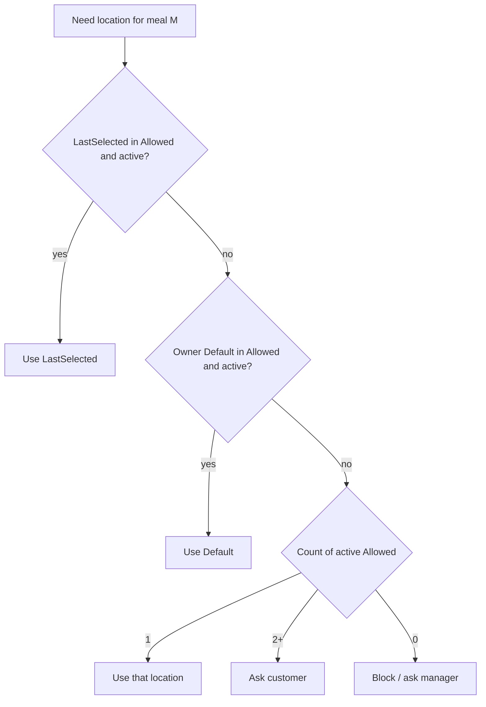

# Mess Delivery Location Management

**Status:** Architecture / source of truth (implementation not started)  
**Last updated:** 11 July 2026  
**Scope:** Mess spaces only  
**Related:** Meal polls, meal participation, Action Center (`space_notifications`), Members UI

This document is the canonical design for Delivery Location Management. Implement phase by phase without revisiting architecture unless a later ADR explicitly supersedes a section.

---

## 1. Architecture overview

### 1.1 Problem

Today:

1. **Customer meal selection** shows a **Deliver To** picker under each meal (Breakfast / Lunch / Dinner).
2. The picker lists **all** active space delivery locations.
3. Customers re-select locations repeatedly and can pick locations that are not intended for them.
4. **Owners** manage the global location catalog (`meal_delivery_locations`) but have **no per-member allowed/default configuration**.

### 1.2 Goals

| Goal | Meaning |
|------|---------|
| Owner control | Owner/manager defines which locations each meal-receiving member may use, per meal type |
| Simple customer UX | Prefer no picker; at most a short allowed list |
| Multi-space safe | Config is per Mess space enrollment, never global user profile |
| Per-meal-type | Breakfast / Lunch / Dinner may differ |
| Minimize re-entry | Remember last selection; fall back to owner default |
| Future-proof | Bulk ops, badges, Action Center — without redesigning polls or location CRUD |

### 1.3 Non-goals

Do **not** redesign:

- Menu Planning
- Delivery Locations catalog screen (create / edit / reorder drop points)
- Payments
- Notification / Pending Action **architecture** (only add new event types into the existing Action Center)
- Dashboard layout

Only **extend** meal participation, poll submit/validation, Members UX, and Action Center publishers.

### 1.4 Current baseline (as-built)

| Concern | Today |
|---------|--------|
| Location catalog | `meal_delivery_locations` (space-scoped, Mess-only CRUD) |
| Poll snapshot | `meal_poll_member_delivery` — one location per `(poll_id, member_id)` |
| Last used | `meal_participation_last_delivery` — per `(participation_id, meal_type)` |
| Legacy default | `meal_participations.default_delivery_location_id` (single location, all meals) |
| Meal enrollment | `meal_participations` on **Member** (not `space_memberships`) |
| Auth / role | `space_memberships` (OWNER / MANAGER / CUSTOMER / …) |

### 1.5 Target model (conceptual)

```
Space (MESS)
  └── meal_delivery_locations          ← catalog (unchanged screen)
  └── Member
        └── meal_participation         ← enrollment + NEW delivery config
              ├── allowed locations per meal type
              ├── default location per meal type
              └── last selected per meal type (customer preference)
  └── meal_poll (date × meal type)
        └── meal_poll_member_delivery  ← immutable snapshot at response time
```

### 1.6 Where configuration lives (and why)

**Product language in this doc:** “Membership delivery configuration” means the member’s **meal enrollment in this Mess space**.

**Technical owner:** `meal_participations` (and child tables), keyed by **Member in Space** — **not** the global User Profile, and **not** the auth-only `space_memberships` row.

| Option | Verdict |
|--------|---------|
| **User Profile** | ❌ Wrong. A person may belong to Mess A and Mess B with different companies/floors. Profile is cross-space. |
| **`space_memberships` only** | ❌ Insufficient. Meal access already lives on **Member + meal_participation**; staff/auth membership is separate from meal enrollment. |
| **`meal_participations` (recommended)** | ✅ Correct. Already owns plan, status, last delivery, and Mess meal access. Delivery rules are meal-enrollment concerns. |

**Why Mess only:** Delivery drop points and multi-location office/floor routing are Mess operational concepts. PG/Hostel occupancy addresses a different domain. Existing `MealDeliveryLocationService` is already Mess-gated; this feature stays Mess-gated.

---

## 2. Phase-wise product design

### Phase 1 — Owner delivery configuration

**UI placement:** New **Delivery Configuration** section on **Mess Member Details** (Meals tab / dedicated subsection). Not on User Profile. Not on Delivery Locations catalog.

**Layout (per meal type: Breakfast, Lunch, Dinner):**

```
Delivery Configuration
  Breakfast
    Allowed Locations   [ multi-select from space catalog ]
    Default Location    [ single select ⊆ Allowed ]
  Lunch
    Allowed Locations
    Default Location
  Dinner
    Allowed Locations
    Default Location
```

**Rules:**

1. Allowed locations ⊆ active `meal_delivery_locations` for the space.
2. Default location **must** be in Allowed (or null only when Allowed is empty — treated as “not configured”).
3. Clearing Allowed clears Default for that meal type.
4. Deactivating/deleting a catalog location removes it from Allowed/Default (see Edge cases).
5. Only members with Mess meal access (active participation / receiving meals) need configuration for share validation (Phase 4).

**Permissions:** OWNER / MANAGER with member+meal manage rights. CUSTOMER cannot edit this section.

**Acceptance:**

- Owner can set allowed + default per meal type for a member.
- Config persists on participation and is readable by poll APIs.
- PG Member Details does not show this section.

---

### Phase 2 — Customer meal selection UX

Replace “show all locations” with enrollment-aware UI **per meal slot that has selections**.

| Situation | UI |
|-----------|-----|
| Exactly **one** allowed location | `Deliver To` · **Company A** (read-only, no picker) |
| **Multiple** allowed | `Deliver To` · **Company A** ✏ → picker of **Allowed only** |
| **Zero** allowed | Block submit for that meal; show “Ask your mess manager to set delivery” (owner should have been blocked at share — Phase 4) |
| Not Mess / no active locations in space | Keep today’s behavior (no Deliver To if catalog empty) |

**Picker contents:** Allowed locations only. Never the full catalog.

**Prefill label:** Resolve display location via Phase 3 priority before render.

**Acceptance:**

- Customer never sees unrelated locations.
- Single-allowed path requires zero taps for location.
- Multi-allowed path edits only within Allowed.

---

### Phase 3 — Last selected location

**Storage:** Extend / formalize per-meal-type preference on participation (existing `meal_participation_last_delivery` is the foundation).

| Field | Meaning |
|-------|---------|
| Last Breakfast | Last successfully submitted Breakfast location for this participation |
| Last Lunch | Same for Lunch |
| Last Dinner | Same for Dinner |

**Write path:** On successful poll response for a meal type, upsert last selected = submitted location (already partially implemented).

**Read / decision flow (complete):**

```
For mealType M when customer opens or submits poll:

1. If LastSelected(M) exists AND is in Allowed(M) AND location is active
      → use LastSelected(M)

2. Else if OwnerDefault(M) exists AND is in Allowed(M) AND location is active
      → use OwnerDefault(M)

3. Else if Allowed(M) has exactly one active location
      → use that location

4. Else if Allowed(M) has multiple active locations
      → require customer choice (picker)

5. Else (Allowed empty or all inactive)
      → cannot submit; show setup message
```

**Diagram:**



---

### Phase 4 — Validation before sharing

**When:** Owner/manager share / open poll for meal type(s) (Menu Share / open poll path).

**Scope filters (all must apply):**

| Filter | Reason |
|--------|--------|
| Space is **MESS** | Feature is Mess-only |
| Member has **active meal participation** | Only meal recipients |
| **Meal access enabled** / participation not stopped | Align with headcount eligibility |
| Meal type **included** in share/open set | Meal-specific |
| **Allowed** locations configured for that meal type (≥ 1 active) | Customer must have a legal set |
| **Default** configured and ∈ Allowed and active | Deterministic prefills + single-location UX |

**Meal-specific validation (critical):**

> Missing **Lunch** config must **never** block opening a **Breakfast** poll.

Validate independently per meal type in the share payload.

**On failure:**

- Do not open/share the failing meal type’s poll (or block the whole share action if UX is single-shot — prefer **per-meal** fail with clear list).
- Primary CTA: **Review Members** → Members list filtered to failing members for that meal type (Phase 5 filters).

**Example copy:**

> 3 members need Lunch delivery setup before this Lunch poll can be shared.

**Acceptance:**

- Breakfast-ready members are not blocked by Lunch gaps.
- Review Members lands on a filtered list.

---

### Phase 5 — Member status (list)

**Surface:** Mess Members list cards (and optionally Member Details header).

**Derived statuses** (from participation config + eligibility):

| Status | Meaning |
|--------|---------|
| Delivery Configured | All meal types the member can receive have Allowed + Default |
| Breakfast Setup Required | Breakfast meal access / plan includes Breakfast but config incomplete |
| Lunch Setup Required | Same for Lunch |
| Dinner Setup Required | Same for Dinner |
| Delivery Setup Required | Two or more meal types incomplete (aggregate) |

**Badge priority (highest first):**

1. Delivery Setup Required (multi)
2. Breakfast Setup Required
3. Lunch Setup Required
4. Dinner Setup Required
5. Delivery Configured (positive / quiet)

**Filtering:** Owner can filter Members by setup status / meal type needing setup.

**Sorting:** Optional — incomplete setup first when filter “Needs delivery setup” is on.

**Bulk identification:** Count chip on Members header: “N need delivery setup”.

---

### Phase 6 — Pending Actions (Action Center)

**Reuse** existing `space_notifications` → Pending Actions pipeline. Do **not** invent a parallel attention system.

| Item | Value |
|------|--------|
| Event | Members missing delivery config for a meal type relevant to operations |
| Notification type | `DELIVERY_CONFIG_REQUIRED` (new enum value) |
| Category | `ACTION_REQUIRED` |
| Recipients | OWNER / MANAGER of the space |
| Grouping | Prefer one pending group with count, e.g. “3 members need Lunch delivery setup” |
| Deep link | Members list with query/filter: `deliverySetup=LUNCH` (or equivalent FE param) |
| Resolve | When no active eligible members remain incomplete for that meal type (sync-from-store) |

**Lifecycle:**

1. **Publish / refresh** via sync service when participation config changes, member meal access changes, location deactivated, or before/after share validation interest.
2. **Dedupe key** stable per `(spaceId, mealType, managerUserId)` or per-member keys aggregated in Pending Action groups — follow payments/complaints pattern (prefer sync-from-store).
3. **Resolve** when config becomes complete or member leaves meal access.
4. **No duplicate** channels beyond in-app until multi-channel is productized.

**Example Pending Action title:** `Delivery Configuration Required`  
**Message:** `3 members require Lunch delivery setup`

---

### Phase 7 — Bulk operations (future)

Document only; not in MVP.

| Capability | Description |
|------------|-------------|
| Bulk Allowed | Select N members → set Allowed for a meal type |
| Bulk Default | Set Default (must be in each member’s Allowed, or also set Allowed) |
| Copy Breakfast → Lunch | Copy Allowed+Default Breakfast → Lunch for selection |
| Copy Lunch → Dinner | Same |
| Import / Export | CSV of memberId × mealType × locationIds (ops tooling) |

Constraints: Mess-only; audit log desirable; never write User Profile.

---

## 3. User flows

### 3.1 Owner configures one member

```
Members → Member Details → Delivery Configuration
  → Select Allowed (Breakfast)
  → Select Default (Breakfast)
  → Repeat Lunch / Dinner
  → Save
  → Pending Action / badges refresh
```

### 3.2 Owner shares Lunch poll

```
Menu Planning / Share → Open Lunch poll
  → Validate Lunch config for eligible members
  → If gaps: block + Review Members (Lunch filter)
  → If OK: open poll (existing open-poll path)
```

### 3.3 Customer selects meals

```
Choose your meals
  → Select dishes for Breakfast
  → Deliver To: show resolved location (Phase 3)
  → If multi-allowed: optional ✏ change within Allowed
  → Submit
  → Snapshot location on poll response
  → Update Last Selected
```

---

## 4. Data model

### 4.1 Catalog (existing)

`meal_delivery_locations` — unchanged as source of drop points.

### 4.2 Participation delivery config (new)

Prefer explicit child tables for clarity and indexing:

**`meal_participation_delivery_allowed`**

| Column | Type | Notes |
|--------|------|--------|
| id | UUID PK | |
| participation_id | UUID FK | → `meal_participations` |
| meal_type | ENUM | BREAKFAST / LUNCH / DINNER |
| delivery_location_id | UUID FK | → `meal_delivery_locations` |
| UNIQUE | (participation_id, meal_type, delivery_location_id) | |

**`meal_participation_delivery_default`**

| Column | Type | Notes |
|--------|------|--------|
| participation_id | UUID | |
| meal_type | ENUM | |
| delivery_location_id | UUID FK | Must also exist in allowed |
| PK / UNIQUE | (participation_id, meal_type) | One default per meal |

### 4.3 Customer preference (existing → keep)

`meal_participation_last_delivery` — Last Selected per meal type (already exists). Treat as Phase 3 SoT.

### 4.4 Response snapshot (existing → keep)

`meal_poll_member_delivery` — location chosen for that poll instance.

**Why snapshot is necessary:**

1. Catalog locations can be renamed, reordered, or deactivated later.
2. Owner may change Allowed/Default after responses are collected.
3. Kitchen / headcount / delivery runs must reflect **what the customer chose at submit time**, not today’s config.
4. Analytics and disputes need an immutable record per poll.

### 4.5 Legacy field

`meal_participations.default_delivery_location_id` (single):

- **Migration:** Copy into per-meal defaults where Allowed will be backfilled (see Migration).
- **After Phase 1:** Stop writing; read only for migration fallback; eventually deprecate.

### 4.6 Entity relationship (logical)

```
MealParticipation 1 ── * MealParticipationDeliveryAllowed
MealParticipation 1 ── * MealParticipationDeliveryDefault   (0..1 per meal_type)
MealParticipation 1 ── * MealParticipationLastDelivery      (0..1 per meal_type)
MealPoll + Member  1 ── 1 MealPollMemberDelivery            (snapshot)
```

---

## 5. API design

### 5.1 New APIs

| Method | Path | Purpose |
|--------|------|---------|
| `GET` | `/api/v1/spaces/{spaceId}/members/{memberId}/meal-delivery-config` | Read Allowed + Default (+ derived status) |
| `PUT` | `/api/v1/spaces/{spaceId}/members/{memberId}/meal-delivery-config` | Replace config for all or per meal type |
| `GET` | `/api/v1/spaces/{spaceId}/meal-delivery-setup-status` | Optional: list members needing setup (filters) |

Alternatively nest under existing participation routes:

- `GET/PUT …/meal-participations/{participationId}/delivery-config`

Prefer **memberId** in path for FE Member Details alignment; resolve participation server-side.

### 5.2 Modified APIs

| API | Change |
|-----|--------|
| `GET …/meal-polls?date=` | `deliveryLocations` for customer → **filtered to Allowed** for caller’s participation; include resolved `suggestedDeliveryLocationId` per meal type |
| `POST …/meal-polls/{date}/responses` | Validate `deliveryLocationId ∈ Allowed(mealType)`; apply Phase 3 if omitted when unambiguous |
| Share / open poll | Run Phase 4 validation; return structured errors `{ mealType, memberIds[], code }` |
| `GET` members list | Optional `deliverySetupStatus` summary fields for badges |
| Member details | Include delivery config summary |

### 5.3 DTO sketches (contract-level)

**DeliveryConfigResponse**

```text
memberId
participationId
meals: [
  {
    mealType
    allowedLocationIds: UUID[]
    allowedLocations: [{ id, name, ... }]   // optional expand
    defaultLocationId: UUID | null
    lastSelectedLocationId: UUID | null     // if caller may see
    status: CONFIGURED | SETUP_REQUIRED
  }
]
overallStatus: CONFIGURED | SETUP_REQUIRED
```

**UpdateDeliveryConfigRequest**

```text
meals: [
  { mealType, allowedLocationIds: UUID[], defaultLocationId: UUID | null }
]
```

**ShareValidationError**

```text
code: DELIVERY_CONFIG_REQUIRED
mealType: LUNCH
memberIds: [...]
message: "3 members require Lunch delivery setup"
```

### 5.4 Validation (server)

- Space type MESS.
- Locations belong to space and are active when adding to Allowed.
- Default ∈ Allowed.
- Submit: location ∈ Allowed for that meal type; location active (or allow inactive only if snapshot already stored — submit must use active).
- Idempotent PUT replaces meal-type rows transactionally.

### 5.5 Backward compatibility

| Stage | Behavior |
|-------|----------|
| Before migration backfill | If no Allowed rows: treat as “legacy mode” — show full active catalog (current UX) **or** soft-require owner setup (product choice: prefer **legacy mode until backfill**, then enforce) |
| After backfill | Enforce Allowed-only for Mess with active catalog |
| Old clients | Ignore new fields; server still validates Allowed on submit once enforcement flag is on |
| Empty catalog | No Deliver To (unchanged) |

**Recommended enforcement flag:** `spaces.delivery_config_enforced` or derive: enforce when ≥1 participation has Allowed rows **or** after migration job completes for the space.

---

## 6. Permissions

| Actor | Configure (Allowed/Default) | View config | Change location at poll (within Allowed) | Manage catalog |
|-------|----------------------------|-------------|------------------------------------------|----------------|
| OWNER | Yes | Yes | No (not a meal customer typically) | Yes |
| MANAGER | Yes (if can manage members/meals) | Yes | No | Yes |
| STAFF | No (unless future assign permission) | Optional read | No | No |
| CUSTOMER | No | Own resolved location only | Yes (Allowed only) | No |
| TENANT | N/A for Mess delivery (PG) | — | — | — |

Notes:

- Configuration is Mess + meal-participation scoped.
- Catalog CRUD remains existing Mess delivery-location permissions.
- Pending Actions for setup → OWNER/MANAGER only.

---

## 7. Validation rules (summary)

1. Allowed ⊆ active catalog locations for space.
2. Default ∈ Allowed (when Default set).
3. Submit location ∈ Allowed(mealType) and active.
4. Share/open validates **per meal type** independently.
5. Eligible member set = active participation + meal access for that meal plan/slot.
6. Snapshot written at submit; later config changes do not rewrite snapshots.
7. Last Selected updated only after successful submit.
8. Deactivated location dropped from Allowed/Default; Last Selected ignored if not allowed.

---

## 8. Edge cases

| Case | Behavior |
|------|----------|
| One allowed location | Auto-select; no picker |
| No allowed location | Customer cannot submit that meal; owner sees Setup Required; share blocked for that meal type |
| Location deleted/deactivated | Remove from Allowed/Default; sync pending actions; Last Selected ignored if invalid |
| Customer in multiple Mess spaces | Separate participation config per space |
| Customer in PG + Mess | Mess config only on Mess participation; PG unaffected |
| Member inactive / participation stopped | Excluded from share validation and pending counts |
| Meal type not on member’s plan | Do not require config for that meal type; do not badge it |
| Default removed | Status → Setup Required until Default set (if Allowed still ≥1) |
| Last Selected no longer allowed | Fall through Phase 3 chain (Default → single Allowed → ask) |
| Catalog empty | No delivery UI; validation skips delivery rules |
| Owner sets Default not in Allowed | Reject API |
| Concurrent edit | Last PUT wins; transactional replace per meal type |

---

## 9. Migration plan

### 9.1 Goals

- No data loss for catalog or historical `meal_poll_member_delivery` snapshots.
- Existing last-delivery rows preserved.
- Smooth UX: avoid overnight hard blocks without owner notice.

### 9.2 Steps

1. **Ship schema** (allowed + default tables) with Flyway; keep legacy `default_delivery_location_id`.
2. **Backfill job (per space):**
   - For each active Mess participation:
     - If legacy `default_delivery_location_id` set and active → add to Allowed for **all meal types on the member’s plan**, set as Default for those types.
     - Else if Last Selected exists per meal type → seed Allowed+Default from last selected.
     - Else → leave unconfigured (Setup Required).
3. **Dual-read period:** Poll GET uses Allowed if present; else legacy full catalog.
4. **Owner notification / Pending Action:** “N members need delivery review” after backfill for unconfigured.
5. **Enforce** Allowed-only submit + share validation (feature flag or space completeness).
6. **Deprecate** writes to legacy single default column.

### 9.3 Existing customers

- Keep ordering meals during dual-read.
- Prefer autofill from legacy default / last selected so most members become “Configured” without manual work.

### 9.4 Existing delivery locations

- Unchanged catalog; no rename/migrate of location IDs.

---

## 10. Notification & Pending Action lifecycle (detail)

| Step | Behavior |
|------|----------|
| Trigger | Config incomplete for eligible member+mealType; or location removed from Allowed |
| Sync | `DeliveryConfigNotificationSyncService` (name indicative) — sync-from-store like payments |
| Type | `DELIVERY_CONFIG_REQUIRED` |
| Deep link | Members + filter |
| Resolve | No remaining incomplete eligible members for that mealType |
| Customer | No ACTION_REQUIRED for this (informational optional later) |

Document new rows in `docs/notification-event-catalog.md` when implementing Phase 6.

---

## 11. FE surface map

| Surface | Change |
|---------|--------|
| `MemberDetailsScreen` (Mess) | Phase 1 Delivery Configuration section |
| `MembersScreen` | Phase 5 badges + filters |
| Customer poll UI (`useMealPollDay` / selection cards) | Phase 2–3 Deliver To |
| Menu Share / open poll | Phase 4 validation + Review Members |
| Action Center | Phase 6 |
| `MealDeliveryLocationsScreen` | **Unchanged** (catalog only) |

---

## 12. Phase-wise implementation plan

| Phase | BE | FE | Depends on |
|-------|----|----|------------|
| **1** | Schema + GET/PUT config APIs | Member Details config UI | Catalog exists |
| **2** | Filter locations on poll GET; submit validation | Deliver To UX | Phase 1 data (or dual-read) |
| **3** | Confirm last-delivery write/read priority | Prefill + decision UI | Phase 1–2 |
| **4** | Share/open validation errors | Review Members CTA | Phase 1 |
| **5** | Status fields on members list API | Badges / filters | Phase 1 |
| **6** | Sync service + `DELIVERY_CONFIG_REQUIRED` | Deep link to filtered members | Phase 5 + Action Center |
| **7** | Bulk endpoints | Bulk UI | Phase 1 stable |

**Suggested MVP cut:** Phases **1 → 2 → 3 → 4** (owner config + customer UX + share gate). Phases 5–6 immediately after for ops visibility. Phase 7 later.

---

## 13. Testing matrix (for implementers)

| Case | Expect |
|------|--------|
| Configure Allowed+Default | Persists; badges green |
| Customer one Allowed | No picker; correct snapshot |
| Customer multi Allowed | Picker subset; Last Selected remembered |
| Share Lunch with gaps | Block Lunch only |
| Share Breakfast OK | Succeeds despite Lunch gaps |
| Deactivate location | Removed from configs; pending updates |
| PG space | No config UI; APIs reject or no-op |
| Legacy backfill | Default copied; no snapshot loss |

---

## 14. Future enhancements

- Geo / route sequencing for delivery runs
- Time-window per location
- Customer self-serve “request new location” (approval workflow)
- WhatsApp confirmation of drop point
- Per-building templates for bulk assign
- Read-only delivery manifest export for kitchen staff

---

## 15. Open decisions (resolve at Phase 1 kickoff)

| # | Question | Recommendation |
|---|----------|----------------|
| 1 | Enforce Allowed-only immediately after backfill vs dual-read window | Dual-read 1 release, then enforce |
| 2 | Require Default whenever Allowed ≥ 1 | **Yes** (simpler customer UX) |
| 3 | Pending Action per meal type vs single aggregate | Per meal type group titles; aggregate count on Members |
| 4 | Nest APIs under member vs participation | Under **memberId** for FE ergonomics |

---

## 16. Document control

| Role | Use |
|------|-----|
| Engineering | Implement against this SoT |
| Product | Phase priority and copy |
| QA | Testing matrix + edge cases |

When implementation ships a phase, update:

- `docs/development-roadmap.md` status
- `docs/notification-event-catalog.md` (Phase 6)
- `docs/api-reference.md` (new endpoints)

---

*End of architecture document. No application code is included by design.*
